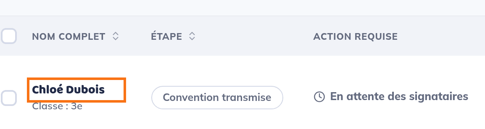
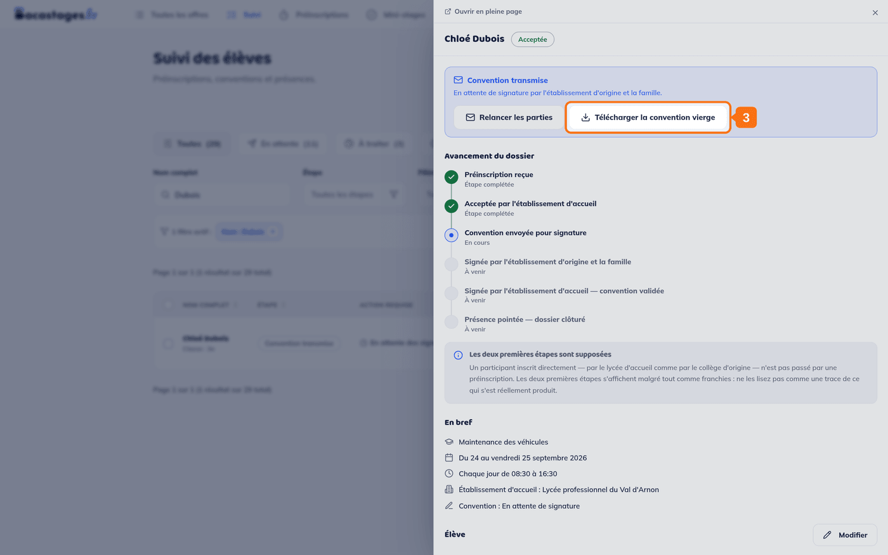
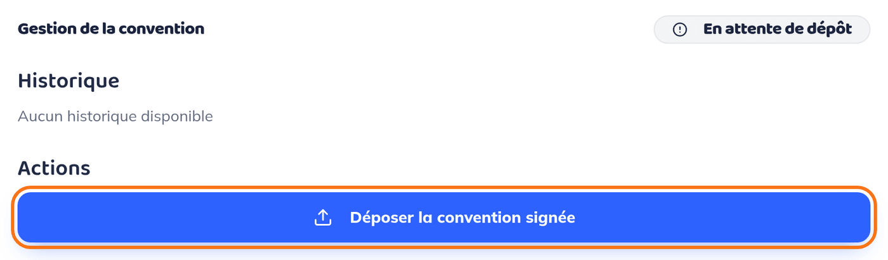

La convention signée se dépose sur Bacastages, dans le dossier de l'élève. Le lycée
d'accueil la vérifie ensuite et la valide.

**Qui dépose la convention ?** La famille — le responsable légal, **ou l'élève lui-même
s'il est majeur**, avec les mêmes droits et par les mêmes écrans. L'établissement
d'origine de l'élève (collège, lycée, CIO) le peut aussi, avec son Compte Inscription.
Le lycée d'accueil peut également la déposer lui-même.

## Vous avez reçu un e-mail de rappel

Cliquez sur le bouton de l'e-mail. Après connexion, vous arrivez **directement sur la
page du dossier de l'élève** : descendez jusqu'à **Gestion de la convention**, puis
passez à l'étape 3.

> **Deux chemins mènent au même endroit.** Le lien d'un e-mail ouvre la **page pleine**
> du dossier. Depuis Bacastages, vous ouvrez le même dossier dans un **tiroir**, par
> l'entrée **Suivi** — c'est le chemin décrit ci-dessous. Le bloc **Gestion de la
> convention** et ses boutons sont identiques des deux côtés, et le tiroir porte en
> haut un lien **Ouvrir en pleine page**.

## Étape 1 : télécharger la convention

<!-- Les images restent en retrait sous leur étape : hors de la liste, elles la coupent et la numérotation repart à 1. -->

1. Dans le menu, ouvrez **Suivi**.
2. Cherchez l'élève par son nom, puis cliquez sur son nom pour ouvrir son dossier.

   

3. En haut du dossier, dans l'encadré **Convention transmise**, cliquez sur
   **Télécharger la convention vierge**.

   

## Étape 2 : la faire signer

Imprimez la convention et faites-la signer par :

- la famille : le responsable légal, ou l'élève lui-même s'il est majeur ;
- l'établissement d'origine.

Le lycée d'accueil intervient en dernier, lorsqu'il valide la convention.

## Étape 3 : déposer la convention signée

1. Dans le dossier de l'élève, descendez jusqu'à **Gestion de la convention**. Côté
   famille, le dossier indique « La convention vous attend : signez-la puis déposez-la
   ci-dessous. »
2. Cliquez sur **Déposer la convention signée**.

   

3. Indiquez votre nom complet.
4. Choisissez le fichier de la convention signée : PDF, PNG ou JPG, de 10 Mo maximum.
5. Cliquez sur **Déposer**.

   

## Après le dépôt

**Selon le réglage du lycée d'accueil, deux suites sont possibles.**

Certains lycées activent la **validation automatique des conventions déposées** : la
convention est alors validée dès son arrivée, sans relecture, et il n'y a plus rien à
attendre. Vous le voyez au statut, qui passe directement à **Validée**.

Sinon — c'est le cas le plus courant — la convention passe **En attente de validation**.
Le lycée d'accueil la vérifie :

- s'il la valide, elle passe **Validée** : il n'y a plus rien à faire ;
- s'il la refuse, elle passe **Refusée**, et le motif apparaît dans l'historique.
  Corrigez ce qui manque, puis cliquez sur **Déposer une nouvelle version**.

Tant que le lycée ne l'a pas validée, la famille, l'élève majeur et l'établissement
d'origine peuvent remplacer le fichier avec **Déposer une nouvelle version**.

Quand la convention est validée, elle vous est **envoyée par e-mail en pièce jointe** —
aux familles comme à l'établissement d'origine. Vous n'avez pas à revenir la chercher.

## Je ne vois pas le bouton « Déposer la convention signée »

- **La convention se signe en ligne.** Quand la signature électronique est en cours, il
  n'y a rien à déposer : ouvrez **À signer** dans le menu et signez la convention en
  ligne.
- **La convention est déjà validée.** Il n'y a plus rien à faire.
- **Votre compte ne permet pas de déposer.** Les comptes Vie scolaire et Professeur
  consultent les dossiers sans pouvoir déposer de convention.
- **L'élève a été désinscrit** du mini-stage.
