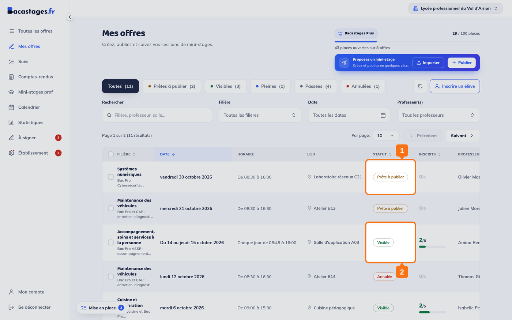
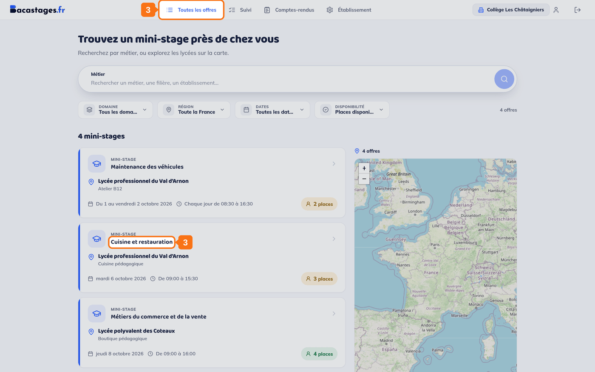
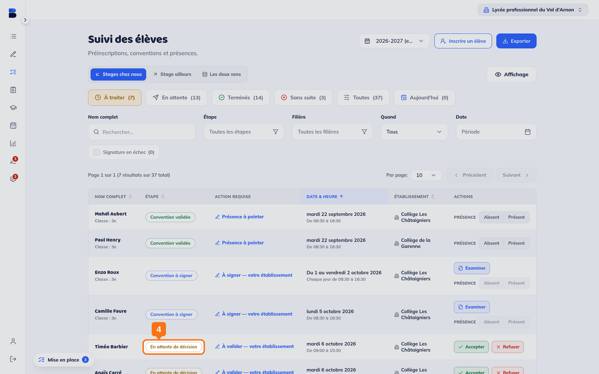
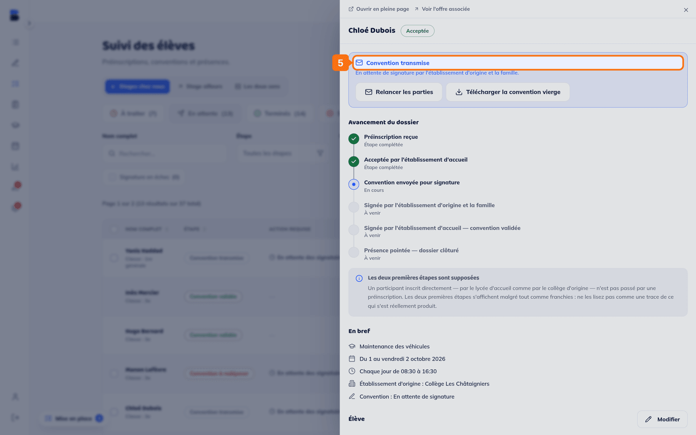
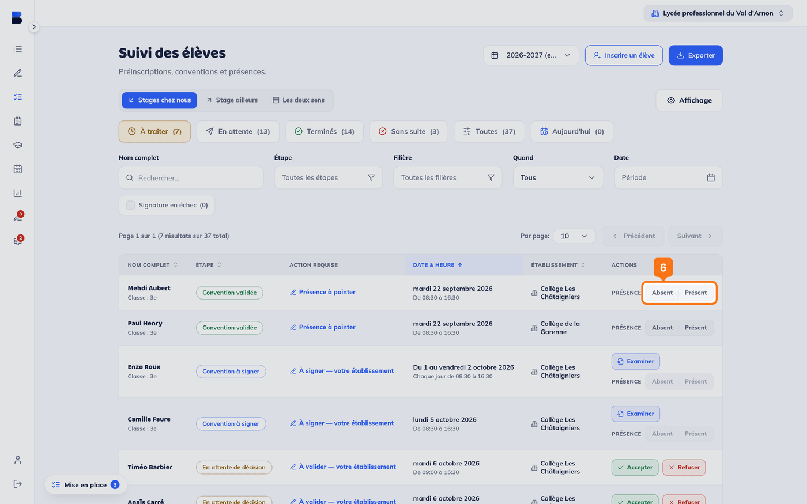
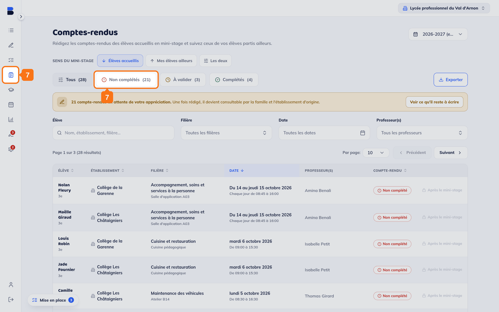

## Objectif

Savoir par quelles étapes passe un mini-stage, et à laquelle vous devez agir.

Cet article est un **article de référence**. Il s'adresse à **toutes les parties**, lycée d'accueil, établissement d'origine et famille, parce qu'aucune ne voit le parcours en entier depuis son écran.

---

## 1. Le lycée crée l'offre

Le lycée d'accueil renseigne les **dates et horaires**, la **filière**, la **salle**, jusqu'à **trois professeurs encadrants** dont le premier est obligatoire, la **capacité d'accueil** et la **description** du programme.

> **La capacité se règle sur l'offre**, et nulle part ailleurs. Une filière n'a pas de capacité.

L'offre naît **« Prête à publier »** : elle n'est visible de personne.

## 2. Le lycée publie l'offre

D'un clic sur **« Publier l'offre »**, elle devient **« Visible »** et apparaît dans **« Toutes les offres »**.

> **Une offre pleine disparaît de la recherche par défaut.** Son état passe à **« Pleine »**, et elle ne ressort que si le chercheur règle le filtre **« Disponibilité »** sur **« Toutes les offres »**. C'est voulu, mais c'est aussi la première cause d'un « je ne trouve pas l'offre dont on m'a parlé ».

## 3. Un élève est inscrit

Deux chemins, selon le réglage du lycée d'accueil :

- **Inscription directe** : l'élève est inscrit tout de suite.
- **Préinscription** : la demande part en attente de décision.

L'inscription est faite par **l'établissement d'origine** de l'élève, ou par **sa famille** lorsque le lycée d'accueil l'autorise. Les uns comme les autres partent de **« Toutes les offres »**.

## 4. La préinscription est validée — par les deux établissements

Une préinscription n'est définitive que quand **l'établissement d'origine et le lycée d'accueil** l'ont tous deux acceptée.

> Tant que l'un des deux n'a pas tranché, **l'autre peut revenir sur son refus**.

Dans le Suivi de chaque établissement, ces dossiers portent l'étape **« En attente de décision »**.

## 5. La convention circule

Dès que l'inscription est définitive, une **convention** est générée, pré-remplie.

Selon le réglage du lycée d'accueil, elle part **sur papier** — téléchargée, signée à la main, redéposée — ou **en signature en ligne**. Le circuit papier est celui de la grande majorité des établissements.

> **Une convention en ligne peut repasser au papier toute seule**, quand l'établissement d'origine de l'élève n'a déclaré aucun signataire : il n'y a alors personne à inviter à signer. L'historique de la convention porte la mention **« Collège d'origine sans signataire déclaré »**.

Le dossier de l'élève porte alors l'encadré **« Convention transmise »**, et dit qui l'on attend.

Le détail complet est dans l'article **« Circuit de validation des conventions sur Bacastages »**.

## 6. Le jour du mini-stage

Le lycée d'accueil **pointe la présence** de chaque élève, sur la ligne de son dossier dans le Suivi. Le sélecteur porte deux positions, **« Absent »** puis **« Présent »**.

> **Le pointage n'ouvre que le premier jour du mini-stage.** Avant, le bouton est inactif.

## 7. Le compte rendu

Après le mini-stage, **l'établissement d'accueil rédige le compte rendu**, en pratique le professeur encadrant. Deux champs : **« Votre appréciation »** et **« Votre commentaire »**.

La rubrique **« Comptes-rendus »** les range par état : **« Non complétés »**, **« À valider »**, **« Complétés »**.

> **La famille ne rédige pas le compte rendu, elle le lit.** Sa rubrique **« Comptes-rendus »** est en lecture seule, et tant que rien n'a été écrit elle affiche : *« L'établissement d'accueil n'a pas encore rédigé le compte-rendu de ce mini-stage. »*

> Le produit dit **« compte rendu »**, et non « bilan » : « bilan » désigne autre chose dans Bacastages.

Le dossier passe alors à **« Terminés »**.

---

## Qui agit, et quand

| Étape | Qui agit | Où |
|---|---|---|
| Créer et publier l'offre | Lycée d'accueil | **Mes offres** |
| Inscrire ou préinscrire | Établissement d'origine, ou famille | **Toutes les offres** |
| Décider d'une préinscription | Les **deux** établissements | **Suivi**, onglet « À traiter » |
| Faire signer et déposer la convention | Famille, élève majeur, ou établissement d'origine | **Suivi**, dossier de l'élève |
| Valider la convention | Lycée d'accueil | **Suivi**, onglet « À traiter » |
| Pointer la présence | Lycée d'accueil | **Suivi**, le jour du stage |
| Rédiger le compte rendu | Professeur encadrant du lycée d'accueil | **Comptes-rendus** |

---

## Deux sorties possibles

Un dossier ne va pas toujours au bout :

- **Refusé** : une préinscription rejetée par l'un des deux établissements, ou une convention refusée ;
- **Désinscrit** : l'élève ne fera pas ce mini-stage.

Les deux rangent le dossier dans l'onglet **« Sans suite »**.

---

## Besoin d'aide ?

- **Par email :** [support@bacastages.fr](mailto:support@bacastages.fr)
- **Par le chat :** la bulle en bas à droite de votre écran
