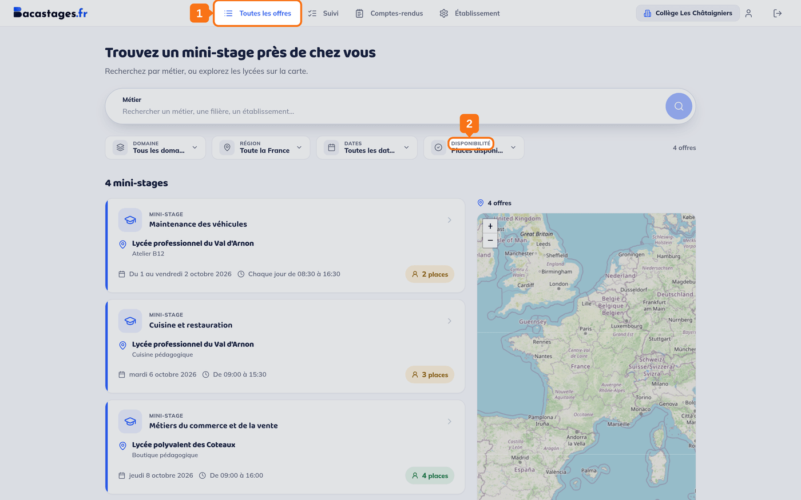
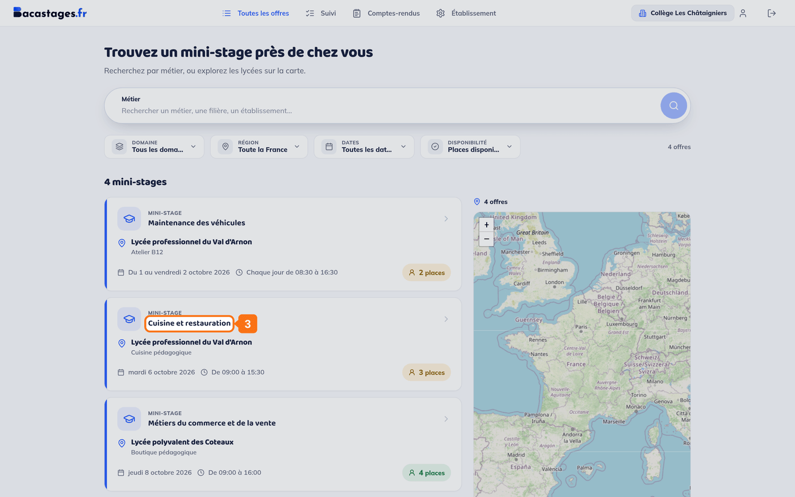
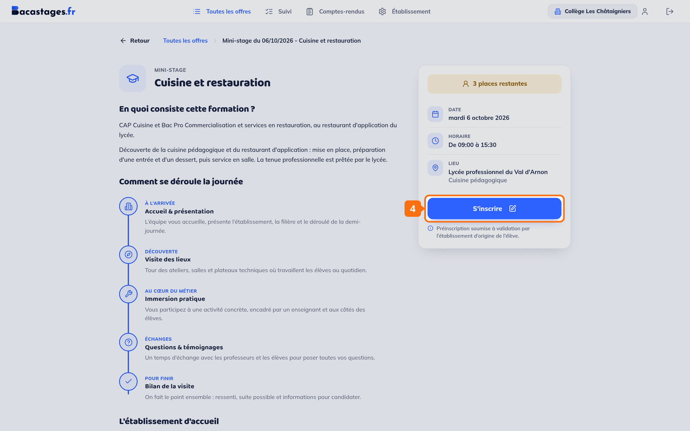
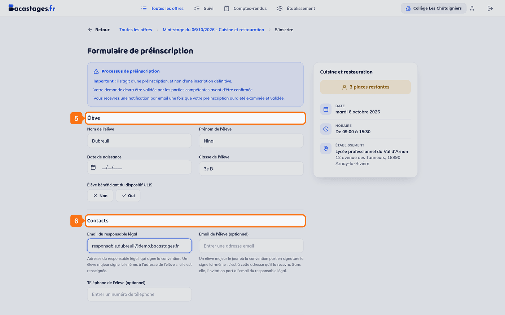
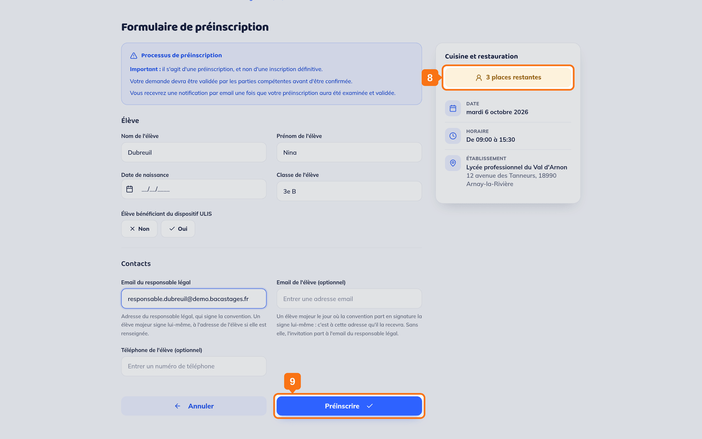

## Objectif

Inscrire un élève de votre établissement à un mini-stage proposé par un lycée.

Cet article s'adresse aux **établissements d'origine** : collèges, lycées, CIO et autres structures qui inscrivent des élèves, avec un **Compte Inscription**.

## Ce qu'il vous faut

- Un compte validé, rattaché à votre établissement
- Le nom, le prénom, la date de naissance et la classe de l'élève
- L'adresse e-mail du responsable légal

---

## 1. Ouvrir la recherche d'offres

Cliquez sur **« Toutes les offres »** dans la barre de navigation.

> **Où se trouve cette barre dépend de votre établissement.** Un établissement abonné a une barre verticale à gauche ; un établissement qui inscrit sans publier, comme un collège, a une barre horizontale en haut de l'écran. Les rubriques y portent les mêmes noms.

> **L'entrée ne s'appelle pas « Offres de mini-stages ».** C'est **« Toutes les offres »**, à ne pas confondre avec **« Mes offres »**, qui n'existe que pour les lycées qui en publient.

## 2. Filtrer la recherche

Un champ **« Métier »** cherche par mot, et quatre filtres bornent la liste : **Domaine**, **Région**, **Dates** et **Disponibilité**.

## 3. Ouvrir l'offre qui vous intéresse

Cliquez sur sa carte dans la liste. La fiche affiche le nombre de **places restantes**, la date, l'horaire et le lieu, ainsi que le déroulé de la journée.

## 4. Cliquer sur « S'inscrire »

Le bouton se trouve dans l'encadré de droite, sous les informations pratiques.

## 5. Renseigner l'élève

Le formulaire demande le **nom**, le **prénom**, la **date de naissance** et la **classe** de l'élève, ainsi que la mention **« Élève bénéficiant du dispositif ULIS »** le cas échéant.

## 6. Renseigner les contacts

Complétez l'**« Email du responsable légal »** : c'est l'adresse de la personne qui signera la convention.

Deux champs facultatifs complètent le bloc : **« Email de l'élève (optionnel)»** et **« Téléphone de l'élève (optionnel) »**.

> **L'e-mail de l'élève sert aux élèves majeurs.** Un élève majeur le jour où la convention part en signature la signe lui-même, et c'est à cette adresse qu'il la reçoit. Sans elle, l'invitation part au responsable légal.

## 7. Joindre les pièces demandées

Certaines filières réclament des documents, une autorisation parentale par exemple. Le bloc n'apparaît que si la filière en déclare. Les pièces **obligatoires** bloquent l'envoi tant qu'elles manquent ; les facultatives peuvent être ajoutées ou non.

## 8. Relire le récapitulatif

La colonne de droite rappelle les informations du mini-stage pendant toute la saisie.

## 9. Valider

Cliquez sur **« Inscrire »**, ou sur **« Préinscrire »** si le lycée d'accueil a activé les préinscriptions. L'en-tête du formulaire le dit aussi : *« il s'agit d'une préinscription, et non d'une inscription définitive »*.

---

## Ce qui se passe ensuite

**Inscription directe** : l'élève est inscrit. Une convention est générée automatiquement, et le dossier apparaît dans votre **« Suivi »**.

**Préinscription** : la demande part au lycée d'accueil. Elle doit être validée **par votre établissement et par le sien** avant de devenir définitive. Suivez-la dans votre **« Suivi »**, onglet **« En attente »**.

---

## L'offre dont on m'a parlé n'apparaît pas

**C'est le cas de figure le plus fréquent, et il a une explication simple.**

Par défaut, la recherche n'affiche que les offres où il **reste des places** : le filtre **« Disponibilité »** est réglé sur **« Places disponibles »**.

Pour voir aussi les créneaux complets, passez-le sur **« Toutes les offres »**. Les offres pleines réapparaissent alors **en fin de liste**, et leur fiche porte un bouton grisé **« Offre complète »**.

> Une offre complète reste utile à consulter : elle vous dit qui propose ce type de mini-stage, et d'autres créneaux de la même filière sont peut-être ouverts.

---

## Besoin d'aide ?

- **Par email :** [support@bacastages.fr](mailto:support@bacastages.fr)
- **Par le chat :** la bulle en bas à droite de votre écran
