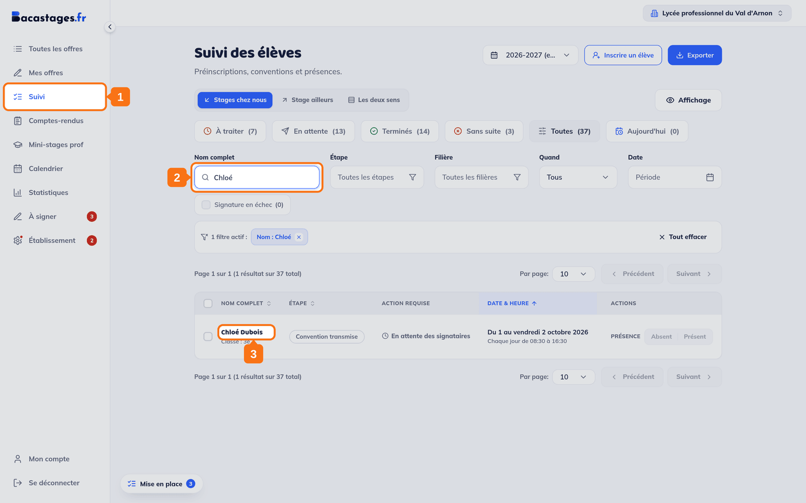
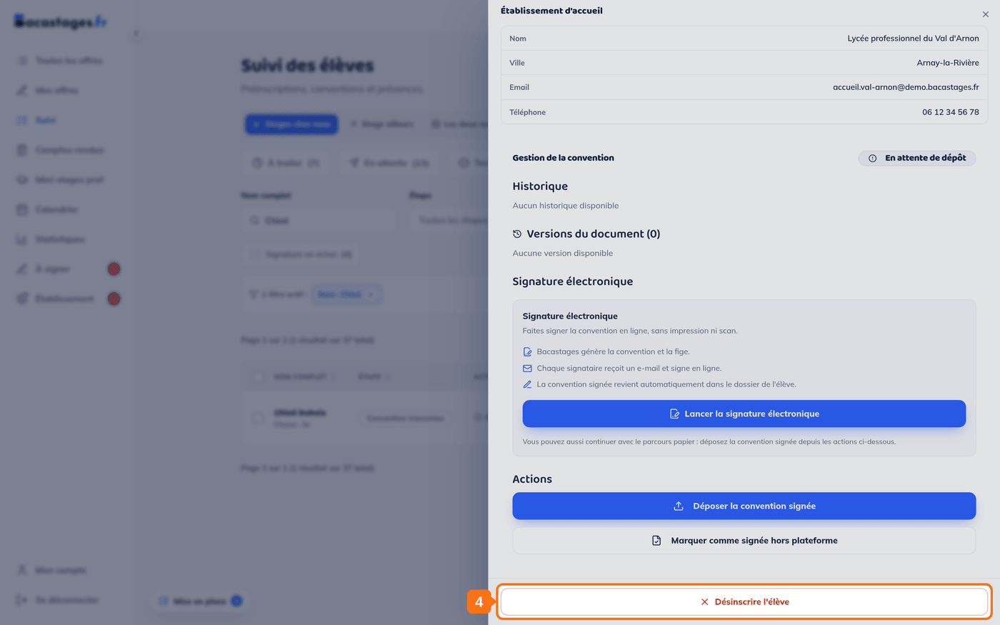
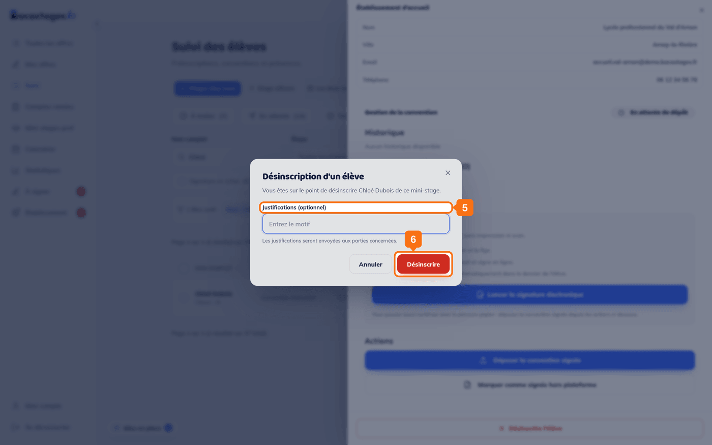
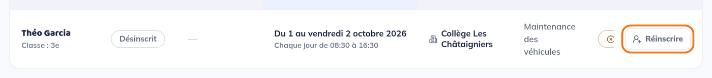

## Objectif

Retirer un élève d'un mini-stage auquel il ne participera pas.

Cet article s'adresse aux **établissements** : le lycée d'accueil comme l'établissement d'origine. Une famille ne peut pas désinscrire elle-même : elle passe par son établissement.

## Ce qu'il vous faut

- Un compte d'établissement autre que **Vie scolaire – Accueil**
- Un élève dont l'inscription est active

---

## 1. Ouvrir le Suivi

Cliquez sur **« Suivi »** dans la barre de gauche.

## 2. Retrouver l'élève

Cherchez-le par son nom, ou parcourez la liste.

> Si l'élève ne ressort pas, vérifiez le **sens**, « Stages chez nous » ou « Stage ailleurs », et **l'année scolaire**.

## 3. Ouvrir son dossier

Cliquez sur la ligne de l'élève. Le tiroir s'ouvre à droite.

## 4. Cliquer sur « Désinscrire l'élève »

Le bouton est **tout en bas du tiroir**, sous le bloc **« Actions »** : faites défiler le tiroir jusqu'au bout. Il s'affiche en rouge, seul sur sa ligne.

> **Il n'apparaît que sur une inscription, et seulement avant le début du mini-stage.** Sur une préinscription encore en attente de décision, le tiroir propose **« Accepter »**, **« Refuser »** et **« Supprimer la préinscription »** : pas de désinscription, puisqu'il n'y a pas encore d'élève inscrit.

## 5. Indiquer une justification, si vous le souhaitez

La fenêtre **« Désinscription d'un élève »** propose un champ **« Justifications (optionnel) »**.

> **Renseignez-le.** L'écran le dit : *« Les justifications seront envoyées aux parties concernées. »* Sans motif, l'autre établissement et la famille reçoivent une annulation sans explication — et vous rappellent.

## 6. Confirmer

Cliquez sur **« Désinscrire »**.

---

## Ce qui se passe ensuite

- Le dossier bascule dans l'onglet **« Sans suite »** et son étape devient **« Désinscrit »**.
- Les parties concernées, famille et autre établissement, sont prévenues par e-mail, avec votre justification.
- La place est rendue à l'offre.

---

## Vous vous êtes trompé

Tant que **le mini-stage n'a pas commencé**, la ligne du dossier porte un bouton **« Réinscrire »**. Il ouvre une confirmation, **« Réinscrire l'élève »**, et informe les parties concernées.

> Ce bouton n'existe plus une fois le mini-stage commencé.

---

## Désinscrire n'est pas supprimer

**« Désinscrire l'élève »** retire l'élève du mini-stage et en garde la trace.

**« Supprimer la préinscription »** efface la demande : *« Cette action est irréversible. »* Ne l'utilisez que pour une demande créée par erreur, jamais pour un renoncement.

> **Les deux boutons ne se rencontrent jamais sur le même dossier.** « Supprimer la préinscription » ne s'affiche que tant que la demande n'est pas validée des deux côtés ; passé ce point, elle a produit une inscription, et c'est « Désinscrire l'élève » qui prend le relais.

---

## Besoin d'aide ?

- **Par email :** [support@bacastages.fr](mailto:support@bacastages.fr)
- **Par le chat :** la bulle en bas à droite de votre écran
