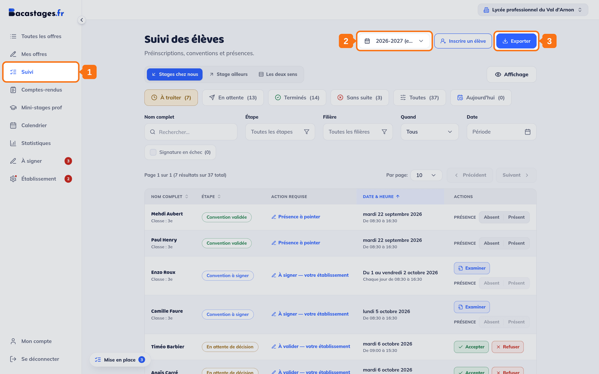
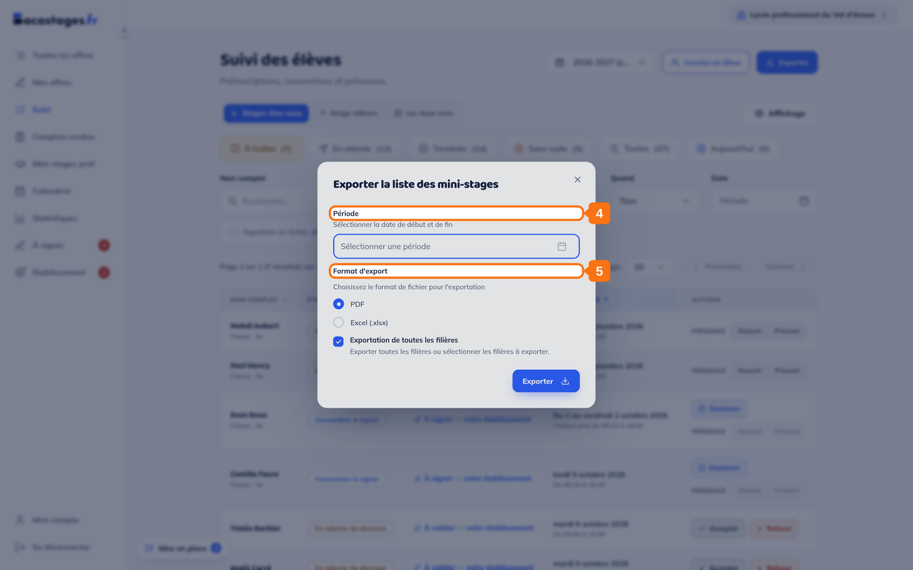
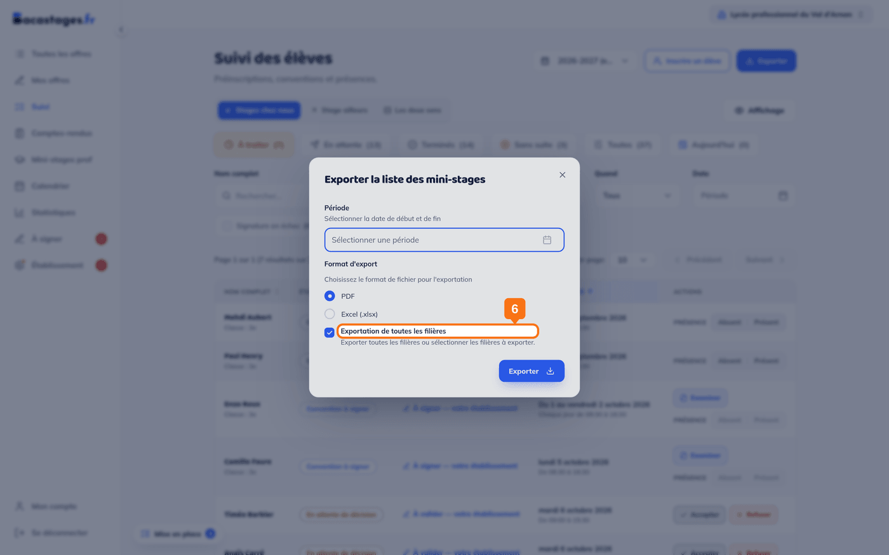
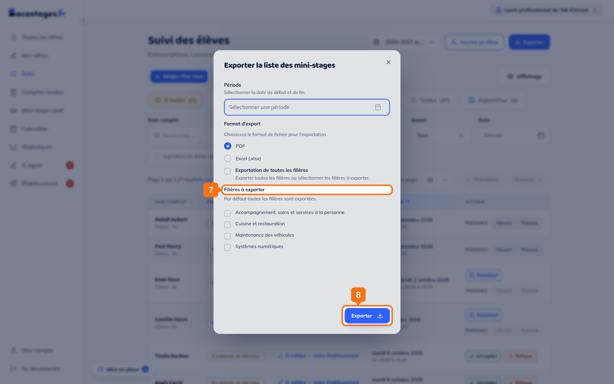

## Objectif

Obtenir la liste des élèves attendus dans votre établissement sur une période donnée, pour l'imprimer, la diffuser, ou la traiter.

Cet article s'adresse aux **lycées d'accueil** — administrateur d'établissement, DDF, ou **Vie scolaire – Accueil**.

## Ce qu'il vous faut

- Des inscriptions enregistrées sur votre établissement
- Un compte **Administrateur établissement**, **DDF** ou **Vie scolaire – Accueil**

---

## 1. Ouvrir le Suivi

Cliquez sur **« Suivi »** dans la barre de gauche.

## 2. Vérifier l'année scolaire

Le sélecteur **« Année scolaire »**, en haut de l'écran, borne aussi l'export.

## 3. Lancer l'export

Cliquez sur **« Exporter »**, en haut à droite. La fenêtre **« Exporter la liste des mini-stages »** s'ouvre.

## 4. Choisir la période

Sous **« Période »**, sélectionnez la **date de début** et la **date de fin**.

> **C'est la période qui décide du contenu**, pas les filtres de l'écran. Un export d'une journée donne la liste d'appel du jour ; un export du trimestre donne tout le trimestre.

## 5. Choisir le format

Sous **« Format d'export »** : **PDF** ou **Excel (.xlsx)**.

> **PDF** pour imprimer et afficher à l'accueil. **Excel** pour trier, compter, ou croiser avec vos propres listes.

## 6. Choisir les filières

La case **« Exportation de toutes les filières »** est cochée par défaut.

## 7. Ou n'en garder que certaines

Décochez-la : la liste **« Filières à exporter »** apparaît, et vous y sélectionnez celles qui vous intéressent.

## 8. Confirmer

Cliquez sur **« Exporter »**. Le fichier se télécharge.

---

## Vous y êtes

Vous disposez de la liste des élèves attendus sur la période, classés par filière.

---

## Besoin d'aide ?

- **Par email :** [support@bacastages.fr](mailto:support@bacastages.fr)
- **Par le chat :** la bulle en bas à droite de votre écran
