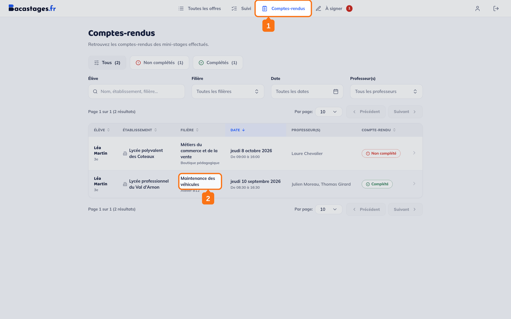
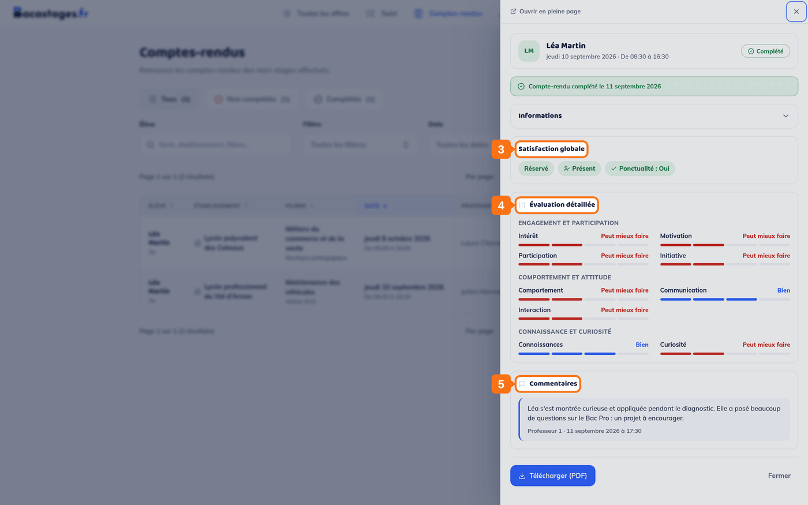
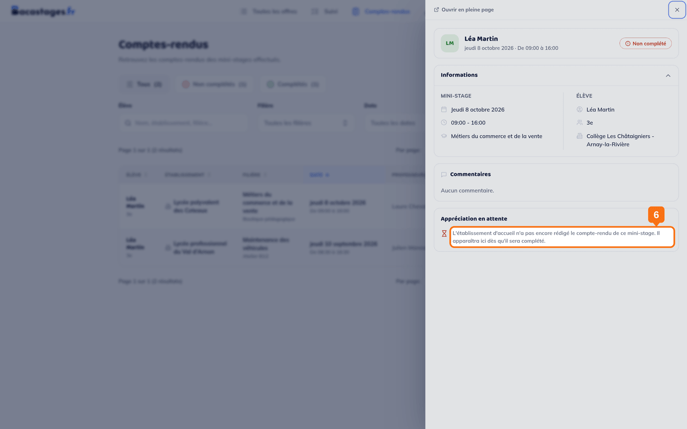

## Objectif

Lire ce que l'établissement d'accueil a écrit sur le mini-stage de votre enfant.

## Ce qu'il faut savoir avant de chercher

**Ce n'est pas vous qui rédigez le compte rendu.** C'est **l'établissement d'accueil** — en pratique le professeur qui a encadré votre enfant. De votre côté, la rubrique est **en lecture seule** : il n'y a ni formulaire à remplir, ni bouton d'envoi.

> Si vous cherchiez comment donner votre avis sur le mini-stage, il n'y a pas d'écran pour cela dans Bacastages. Adressez-vous directement à l'établissement d'accueil ou à celui de votre enfant.

## Ce qu'il vous faut

- Un compte famille connecté
- Un mini-stage terminé

---

## 1. Ouvrir la rubrique

Cliquez sur **« Comptes-rendus »** dans la navigation.

> **L'entrée ne s'appelle pas « Bilans ».** Dans Bacastages, « bilan » désigne autre chose : si vous cherchez ce mot, vous ne trouverez rien.

## 2. Ouvrir le mini-stage concerné

Trois onglets trient la liste : **Tous**, **Non complétés**, **Complétés**. Cliquez sur la ligne du mini-stage, et le compte rendu s'affiche dans un panneau sur la droite.

## 3. Lire le compte rendu

Selon l'établissement d'accueil, il comporte :

- une **satisfaction globale**, et la **présence** et la **ponctualité** à côté d'elle ;
- une **évaluation détaillée** en neuf critères, rangés en trois groupes : *engagement et participation* (intérêt, motivation, participation, initiative), *comportement et attitude* (comportement, communication, interaction), *connaissance et curiosité* (connaissances, curiosité) ;
- des **commentaires** écrits par le ou les professeurs encadrants.

> Certains établissements ont activé le format court : dans ce cas, seules la satisfaction globale et les commentaires apparaissent. C'est un choix de l'établissement, pas un compte rendu incomplet.

> **Les auteurs des commentaires ne sont pas nommés** de votre côté : ils apparaissent en « Professeur 1 », « Professeur 2 ». Seul l'établissement d'accueil lit les noms de ses propres enseignants.

> Un bouton **« Télécharger (PDF) »** en bas du panneau vous en donne une copie à conserver.

---

## Le compte rendu n'est pas encore là

Le mini-stage est marqué **« Non complété »** dans la liste, et le panneau vous le dit lui-même, sous le titre **« Appréciation en attente »** :

> *« L'établissement d'accueil n'a pas encore rédigé le compte-rendu de ce mini-stage. Il apparaîtra ici dès qu'il sera complété. »*

**Il n'y a rien à faire de votre côté, et aucun bouton pour le réclamer.** Le compte rendu apparaîtra tout seul une fois écrit.

> Si le délai vous paraît long, c'est à l'établissement d'accueil qu'il faut s'adresser — Bacastages ne peut pas le rédiger à sa place.

---

## Qui d'autre y a accès ?

L'établissement d'origine de votre enfant le consulte également. Le compte rendu n'est pas un document privé entre l'établissement d'accueil et vous.

---

## Besoin d'aide ?

- **Par email :** [support@bacastages.fr](mailto:support@bacastages.fr)
- **Par le chat :** la bulle en bas à droite de votre écran
