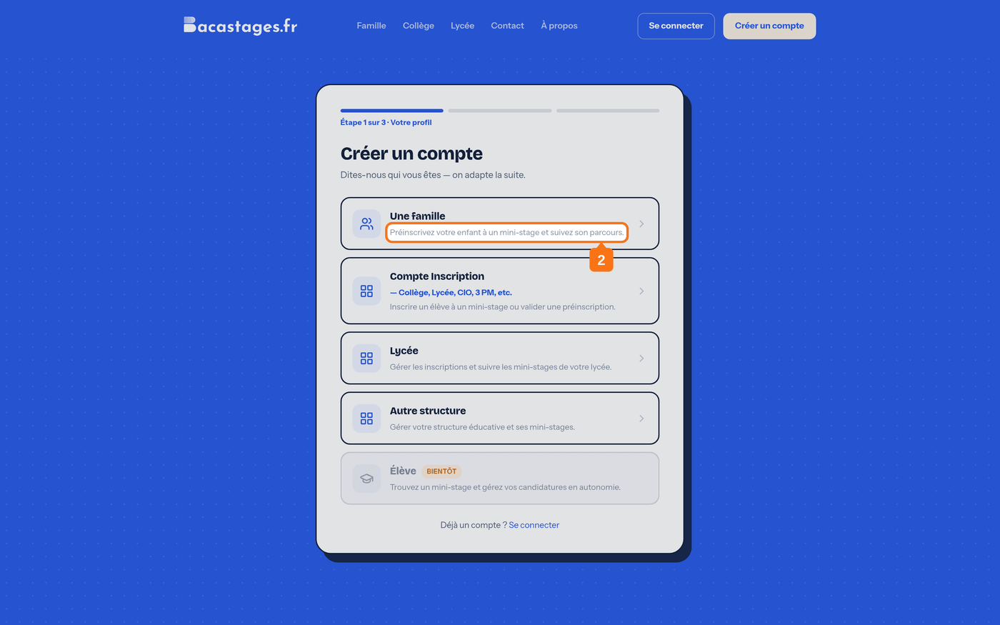
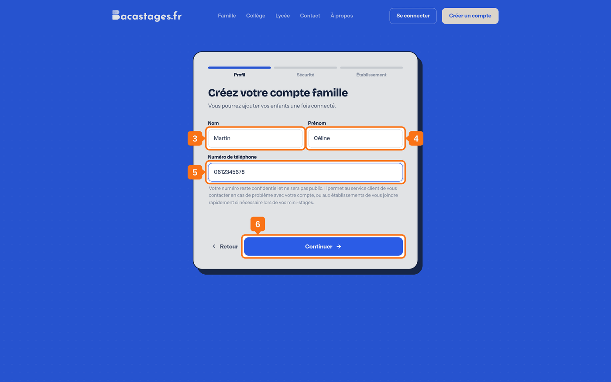
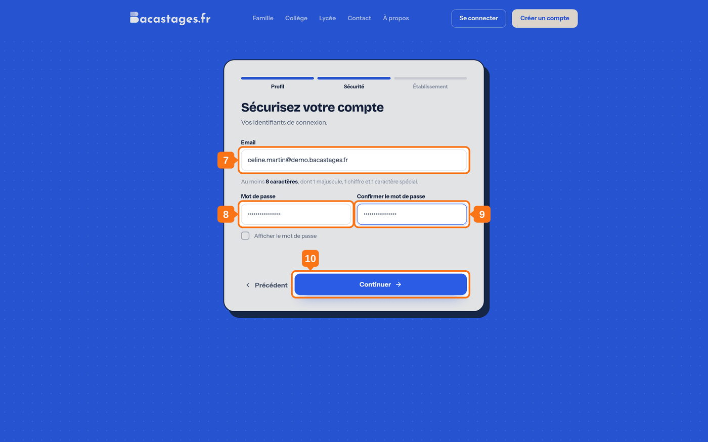
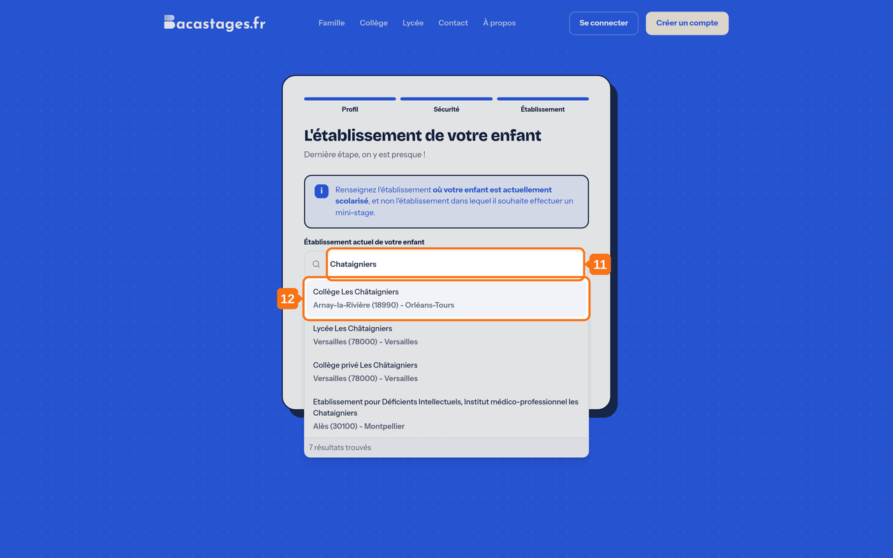
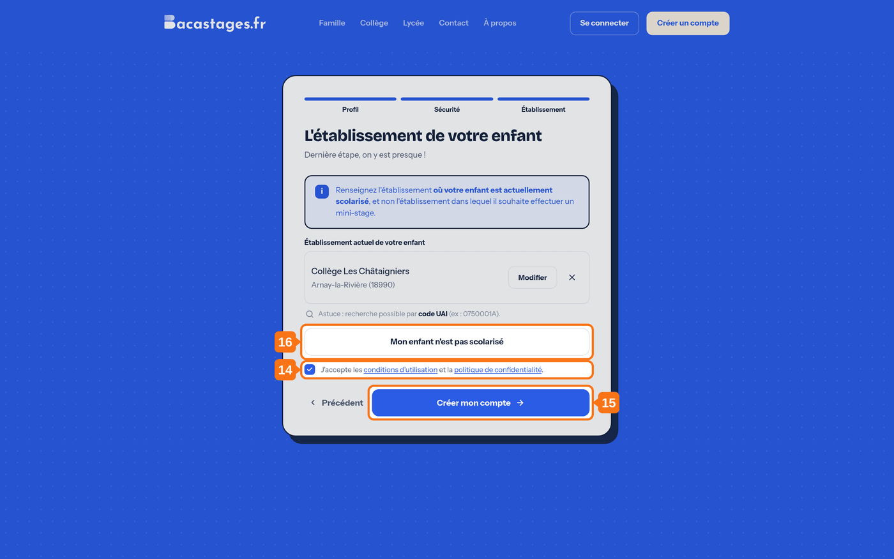

## Objectif

Créer votre compte famille pour préinscrire votre enfant à des mini-stages.

## Ce qu'il vous faut

- Une adresse e-mail que vous consultez régulièrement
- Le nom de l'établissement **où votre enfant est actuellement scolarisé**

---

## 1. Ouvrir la page d'inscription

Sur **bacastages.fr**, cliquez sur **« Créer un compte gratuit »**.

## 2. Choisir la carte « Une famille »

L'écran **« Étape 1 sur 3 · Votre profil »** propose plusieurs cartes de profil. Prenez **« Une famille »** : *« Préinscrivez votre enfant à un mini-stage et suivez son parcours. »*

> **La carte « Élève » porte la mention « Bientôt »** et n'ouvre pas de parcours : un élève ne peut pas encore créer son propre compte. C'est bien depuis votre compte famille que se font les demandes.

---

## Étape 1 : Profil

L'écran s'intitule **« Créez votre compte famille »** : *« Vous pourrez ajouter vos enfants une fois connecté. »*

## 3. Renseigner votre nom

## 4. Renseigner votre prénom

## 5. Renseigner votre téléphone

> **Il ne sera pas public.** Il permet au service client de vous joindre, et aux établissements de vous contacter rapidement pendant le mini-stage.

## 6. Continuer

---

## Étape 2 : Sécurité

L'écran s'intitule **« Sécurisez votre compte »**.

## 7. Renseigner votre adresse e-mail

Elle servira d'identifiant, et recevra les conventions, les rappels et les comptes rendus.

## 8. Choisir un mot de passe

**8 caractères au minimum**, dont **une minuscule, une majuscule, un chiffre et un caractère spécial**, et **aucun espace**.

> C'est la règle complète, et elle est appliquée à la lettre. Un mot de passe de huit lettres sera refusé sans que vous sachiez toujours pourquoi.

## 9. Confirmer le mot de passe

## 10. Continuer

---

## Étape 3 : Établissement

L'écran s'intitule **« L'établissement de votre enfant »**.

## 11. Chercher l'établissement de votre enfant

Le champ s'appelle **« Établissement actuel de votre enfant »**.

> **C'est l'erreur la plus fréquente**, et l'écran vous prévient : *« Renseignez l'établissement où votre enfant est actuellement scolarisé, et non l'établissement dans lequel il souhaite effectuer un mini-stage. »*
>
> Autrement dit : **son collège**, pas le lycée qu'il veut visiter.

## 12. Le sélectionner dans la liste

> Si vous ne le trouvez pas, essayez son **code UAI** ou le **code postal** de la commune. L'écran rappelle lui-même l'astuce sous le champ. Voyez aussi **« Mon établissement n'apparaît pas dans la recherche »**.

## 13. Confirmer votre sélection

Une fenêtre **« Vérifiez votre sélection »** s'ouvre et vous repose la question : est-ce bien l'établissement où votre enfant est **actuellement scolarisé** ? Répondez **« Oui »** pour continuer.

> Cette fenêtre n'est pas une formalité : c'est le dernier filet avant la confusion entre le collège d'origine et le lycée d'accueil.

## 14. Accepter les conditions

Cochez **« J'accepte les conditions d'utilisation et la politique de confidentialité »**. Sans cette case, le bouton ne fait rien.

## 15. Créer le compte

Cliquez sur **« Créer mon compte »**.

## 16. Ouvrir l'e-mail de validation

Il arrive de **team@notif.bacastages.fr**. S'il n'est pas dans votre boîte de réception, regardez votre courrier indésirable.

## 17. Cliquer sur le lien de validation

Votre compte est actif.

> **Vous n'avez rien reçu ?** Sur la page de connexion, un bouton **« Renvoyer un lien »** apparaît tant que votre adresse n'est pas validée.

---

## Si votre enfant n'est pas scolarisé

Un bouton **« Mon enfant n'est pas scolarisé »** vous attend à l'étape 3, juste au-dessus de la case des conditions.

> **Attention : ce chemin ne crée pas de compte.** L'écran le dit en gras : *« Aucun compte ne sera créé. »* Vous êtes dirigé vers un formulaire de contact, et l'équipe Bacastages vous rappelle pour étudier votre situation.
>
> Un bouton **« Revenir à la recherche d'établissement »** permet de faire machine arrière si vous l'aviez pris par erreur.

---

## Vous y êtes

Connectez-vous : **« Toutes les offres »** vous donne accès aux mini-stages proposés.

---

## Besoin d'aide ?

- **Par email :** [support@bacastages.fr](mailto:support@bacastages.fr)
- **Par le chat :** la bulle en bas à droite de votre écran
