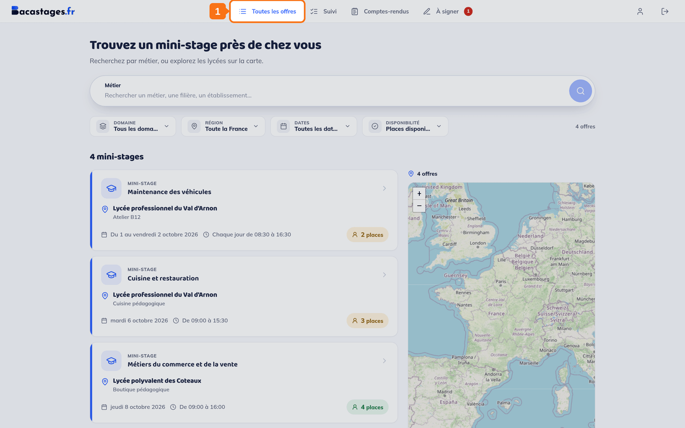
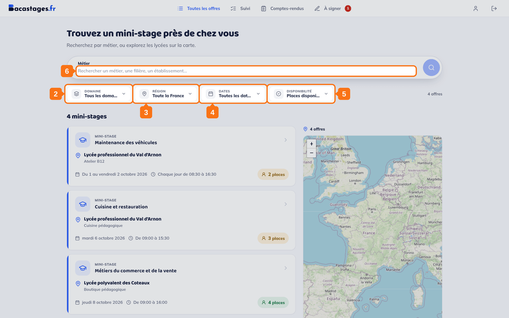
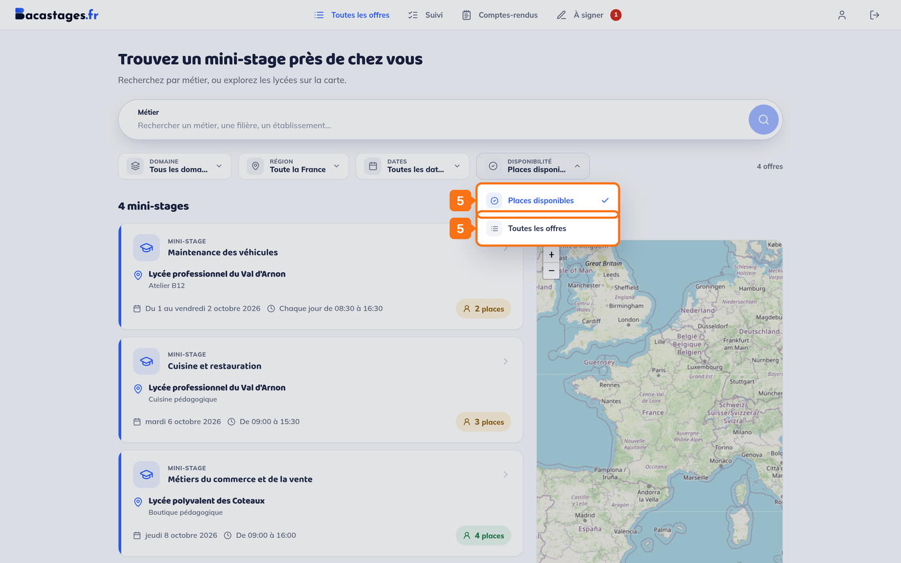
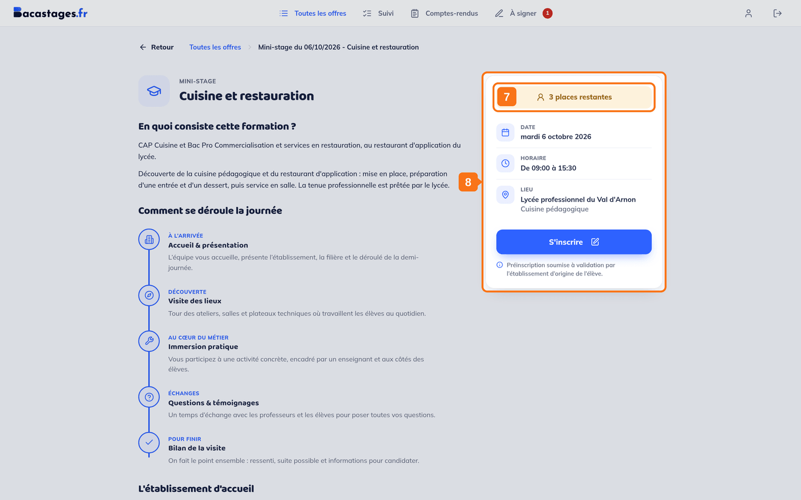
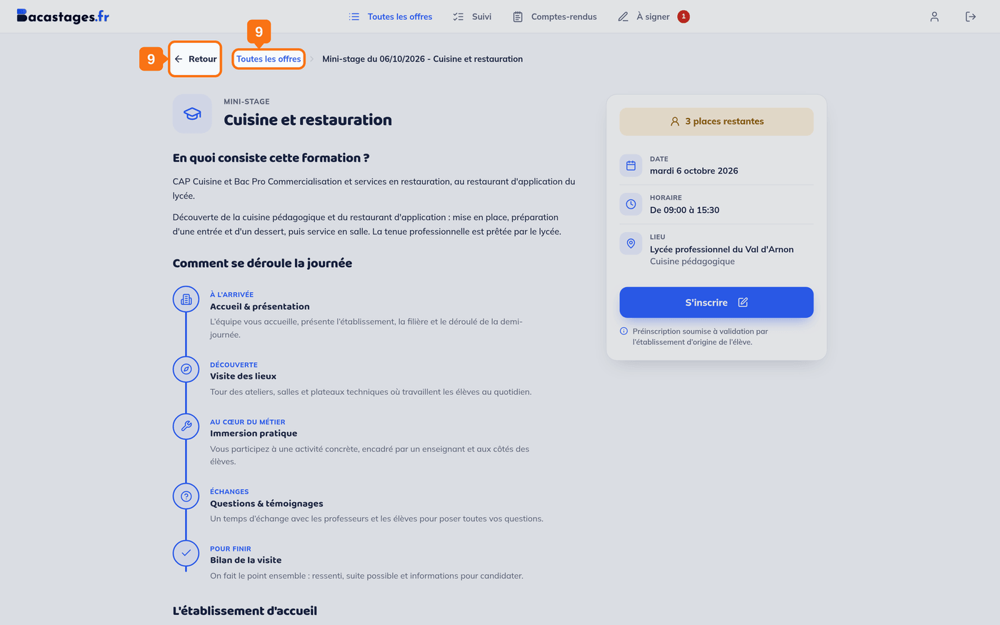

## Objectif

Trouver les mini-stages qui correspondent à ce que cherche votre enfant.

## Ce qu'il vous faut

- Un compte famille connecté

---

## 1. Ouvrir la liste des offres

Cliquez sur **« Toutes les offres »** dans la navigation.

> **L'entrée ne s'appelle pas « Offres de mini-stages ».** C'est **« Toutes les offres »**.

> **Une carte accompagne la liste.** Les offres y sont placées à l'adresse de l'établissement d'accueil : c'est un autre moyen de repérer ce qui est proche de chez vous.

## 2. Filtrer par domaine

Le menu **« Domaine »** regroupe les offres par famille de métiers, et annonce le nombre de filières de chacune.

## 3. Filtrer par région

## 4. Filtrer par dates

Le menu **« Dates »** vous laisse choisir une période, celle des vacances de votre enfant par exemple.

## 5. Ajuster la disponibilité

Le menu **« Disponibilité »** est réglé sur **« Places disponibles »**.

> Passez-le sur **« Toutes les offres »** pour voir aussi les créneaux **complets** : ils apparaissent alors en fin de liste. C'est utile pour repérer les établissements qui proposent ce type de mini-stage, même si ce créneau-ci est plein.

## 6. Chercher par le nom

Au-dessus des filtres, le champ **« Métier »** accepte bien plus que son intitulé : *« Rechercher un métier, une filière, un établissement… »*. C'est lui qu'il faut utiliser pour une spécialité précise ou un lycée nommé.

---

## Les quatre filtres, et rien d'autre

**Domaine**, **Région**, **Dates**, **Disponibilité**. Il n'existe pas de filtre « Secteur », ni par type d'établissement, ni par demi-journée.

Pour tout le reste, utilisez le champ de recherche.

---

## 7. Ouvrir une offre

Sa fiche annonce, dans l'encadré de droite :

- le nombre de **places restantes**, ou la mention **« Complet »** ;
- la **date** ;
- l'**horaire** ;
- le **lieu**, c'est-à-dire l'établissement d'accueil et la salle quand elle est précisée ;
- le bouton **« S'inscrire »**.

Le reste de la page présente le programme du mini-stage sous **« Comment se déroule la journée »**, la filière concernée et l'établissement qui accueille, avec son adresse et un lien vers son itinéraire.

## 8. Revenir à la liste

En haut de la fiche, le bouton **« Retour »** et le lien **« Toutes les offres »** vous y ramènent l'un comme l'autre, **en conservant vos filtres**.

> **Il n'y a pas de bouton « Retour aux offres »** en bas de la fiche : ce libellé n'apparaît que sur l'écran d'erreur, quand une offre ne peut pas s'afficher.

---

## Vous y êtes

Vous avez repéré une ou plusieurs offres. La suite est dans l'article **« Inscrire son enfant à un mini-stage »**.

> **Les places partent vite.** Une offre repérée aujourd'hui peut être complète la semaine prochaine : si elle convient, ne tardez pas.

---

## Besoin d'aide ?

- **Par email :** [support@bacastages.fr](mailto:support@bacastages.fr)
- **Par le chat :** la bulle en bas à droite de votre écran
