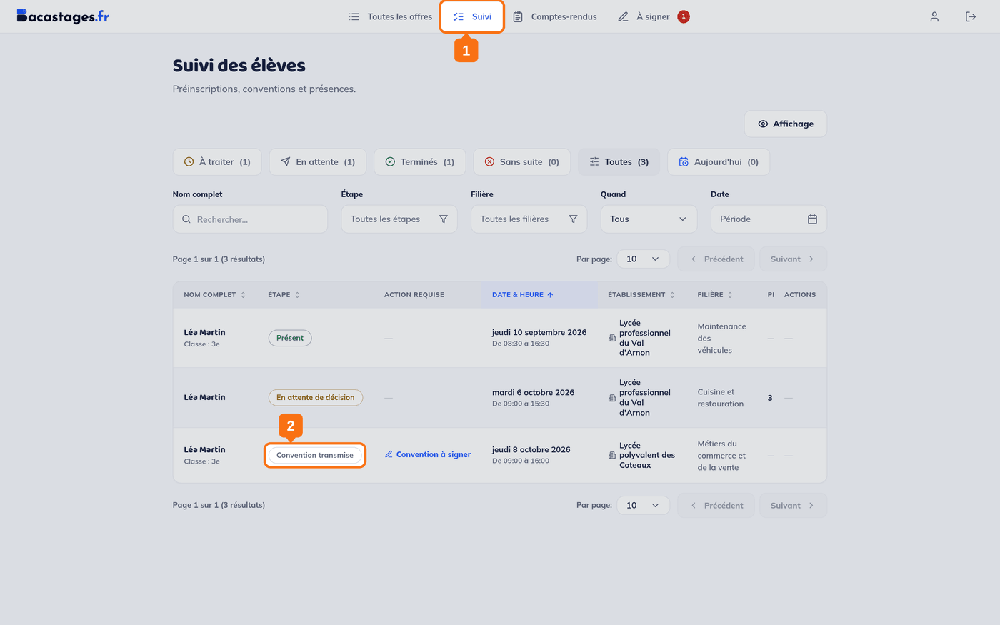
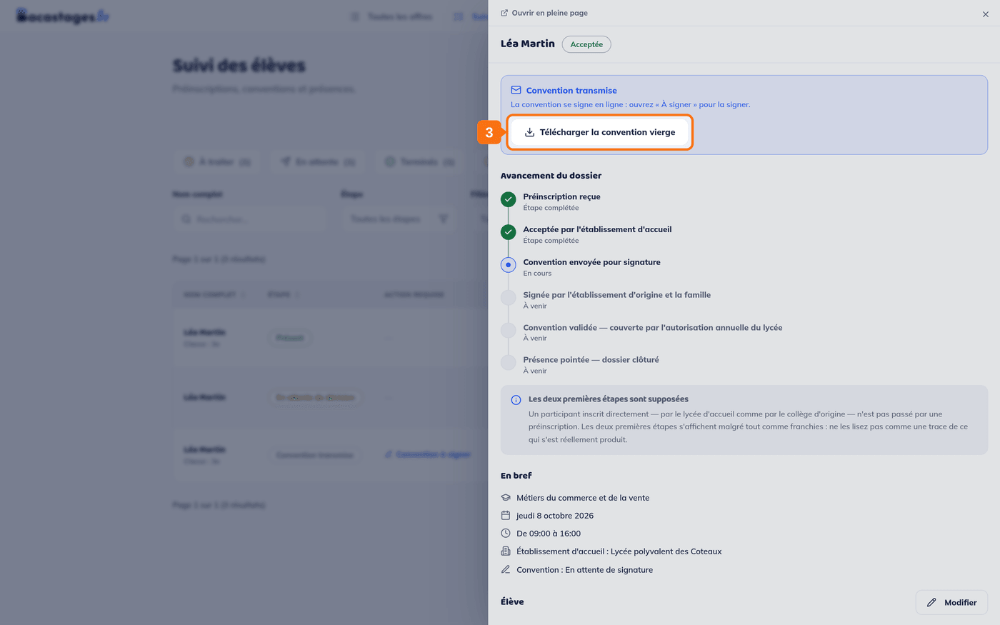
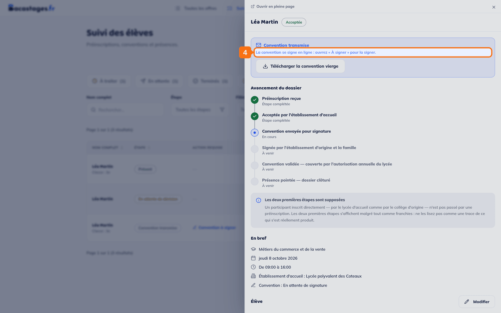

## Objectif

Récupérer la convention de mini-stage, la faire signer, et la remettre à l'établissement d'accueil.

Cet article s'adresse aux **familles** — le responsable légal, **ou l'élève lui-même s'il est majeur**, qui dispose exactement des mêmes droits et des mêmes écrans.

## Ce qu'il vous faut

- Une inscription validée par les deux établissements
- De quoi imprimer et numériser, ou un téléphone pour photographier le document signé

---

## Le plus simple : le lien reçu par e-mail

Bacastages vous envoie un e-mail dès que la convention est prête, puis des rappels si elle tarde. **Le bouton de cet e-mail ouvre directement le dossier de votre enfant** — c'est le chemin le plus court, et celui que nous vous recommandons.

Ces e-mails partent de **team@notif.bacastages.fr**. S'ils n'arrivent pas, regardez votre courrier indésirable.

---

## Depuis votre espace

## 1. Ouvrir le Suivi

Cliquez sur **« Suivi »** dans la navigation.

> **Il n'y a pas de rubrique « Conventions »** dans votre espace : la convention vit dans le dossier de votre enfant.

## 2. Ouvrir le dossier de votre enfant

Cliquez sur sa ligne. Un panneau s'ouvre.

> L'onglet **« Toutes »** montre tous ses dossiers d'un coup. La colonne **« Étape »** vous dira lequel en est à la convention.

---

## Télécharger, signer, déposer

## 3. Télécharger la convention

Dans l'encadré **« Convention transmise »**, en haut du dossier, cliquez sur **« Télécharger la convention vierge »**.

## 4. L'imprimer

## 5. La faire signer

Par vous — ou par votre enfant s'il est majeur — puis par **l'établissement d'origine** de votre enfant.

> **Le lycée d'accueil signe en dernier**, au moment où il valide. Ne l'attendez pas pour déposer.

## 6. Numériser le document signé

Un scan, ou une photo bien lisible de **toutes** les pages.

## 7. Cliquer sur « Déposer la convention signée »

Le bouton se trouve plus bas dans le dossier, dans le bloc **« Gestion de la convention »**.

## 8. Indiquer votre nom complet

Le champ **« Votre nom complet »** est **obligatoire** : sans lui, le dépôt ne part pas.

## 9. Choisir le fichier

Formats acceptés : **PDF**, **PNG**, **JPG**, **JPEG**. **10 Mo au maximum.**

> **Cette limite n'est annoncée nulle part avant l'envoi.** Une photo prise au téléphone la dépasse souvent : si le fichier est refusé, réduisez la définition de vos images avant de réessayer.

## 10. Déposer

Cliquez sur **« Déposer »**.

---

## Ce qui se passe ensuite

Le lycée d'accueil relit la convention, puis :

- **il la valide** — vous la recevez alors **en pièce jointe** par e-mail, et il n'y a plus rien à faire ;
- **il la refuse** — avec un motif, qui vous est transmis. Corrigez ce qui manque, puis déposez à nouveau.

> Certains établissements valident **automatiquement** les conventions déposées. Dans ce cas, la vôtre passe « Validée » dès son arrivée.

---

## Vous avez déposé le mauvais fichier

Rouvrez le dossier : le bouton devient **« Déposer une nouvelle version »**. C'est la dernière version déposée qui sera examinée.

---

## Vous ne voyez pas le bouton de dépôt

Quatre explications possibles :

- **la convention se signe en ligne.** Il n'y a alors rien à déposer, et l'écran vous le dit à la place du bouton : *« La convention se signe en ligne : ouvrez "À signer" pour la signer. »* Vous recevez aussi une invitation par e-mail ;
- **elle est déjà validée** ;
- **votre enfant a été désinscrit** du mini-stage ;
- **vous n'êtes pas encore arrivé à l'étape** : l'inscription doit être définitive.

---

## Besoin d'aide ?

- **Par email :** [support@bacastages.fr](mailto:support@bacastages.fr)
- **Par le chat :** la bulle en bas à droite de votre écran
