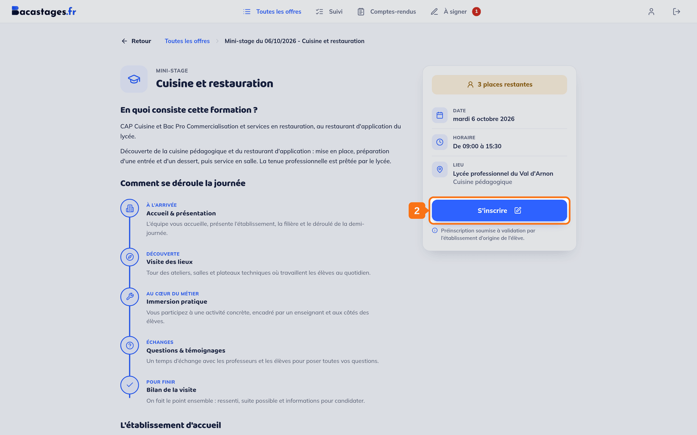
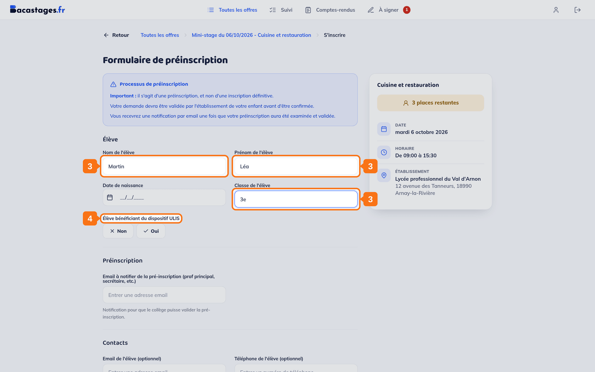
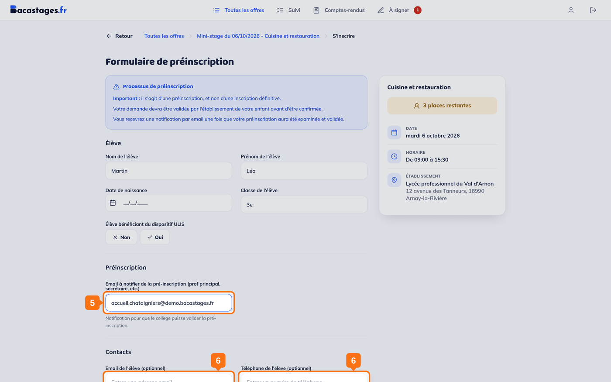
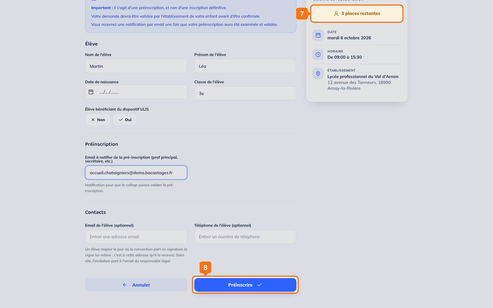

## Objectif

Demander une place pour votre enfant sur une offre de mini-stage.

## Ce qu'il vous faut

- Un compte famille connecté
- Le nom, le prénom, la date de naissance et la classe de votre enfant
- L'adresse e-mail de la personne à prévenir dans l'établissement de votre enfant : professeur principal, secrétariat…
- Les pièces éventuellement demandées par l'établissement d'accueil

---

## 1. Ouvrir l'offre

Depuis **« Toutes les offres »**, cliquez sur celle qui vous intéresse.

## 2. Cliquer sur « S'inscrire »

Le bouton se trouve dans l'encadré de droite, sous les informations pratiques.

> **Si le bouton affiche « Offre complète »** et reste inactif, il n'y a plus de place sur ce créneau. Cherchez un autre créneau de la même filière.

## 3. Renseigner votre enfant

Sous **« Élève »**, le formulaire demande son **nom**, son **prénom**, sa **date de naissance** et sa **classe**.

## 4. Signaler le dispositif ULIS, s'il s'applique

Deux boutons, **« Non »** et **« Oui »**, sous la mention **« Élève bénéficiant du dispositif ULIS »**.

## 5. Indiquer qui prévenir dans l'établissement de votre enfant

Sous **« Préinscription »**, le champ **« Email à notifier de la pré-inscription »** attend l'adresse du professeur principal, du secrétariat ou de la personne qui suivra la demande. *« Notification pour que le collège puisse valider la pré-inscription. »*

> **Votre propre adresse ne vous est pas redemandée.** C'est celle de votre compte qui recevra la convention, les rappels et le compte rendu. Vous la changez, s'il le faut, depuis **« Mon compte »**.

## 6. Renseigner les contacts de votre enfant (facultatif)

Sous **« Contacts »**, l'**e-mail** et le **téléphone** de l'élève.

> **L'e-mail de l'élève n'est pas décoratif.** Un élève majeur le jour où la convention part en signature la signe lui-même : c'est à cette adresse qu'il la recevra. Sans elle, l'invitation part à l'adresse du responsable légal.

## 7. Relire le récapitulatif

La colonne de droite rappelle la filière, les places restantes, la date, l'horaire et l'établissement pendant toute la saisie.

## 8. Envoyer la demande

Le bouton s'appelle **« Préinscrire »**, ou **« Inscrire »** si l'établissement d'accueil n'exige pas de préinscription.

> **Certaines offres réclament des pièces jointes.** Elles apparaissent alors dans le formulaire, et celles marquées obligatoires empêchent l'envoi tant qu'elles manquent. La plupart des offres n'en demandent aucune.

---

## Si le bouton d'inscription n'apparaît pas

Vous voyez à la place un encadré **« Inscription via votre établissement »** :

> *« Pour ce mini-stage, les inscriptions sont gérées directement par les établissements scolaires. Rapprochez-vous de votre secrétariat ou de votre professeur référent qui pourra procéder à votre inscription. »*

**Ce n'est pas un problème technique :** cet établissement d'accueil a choisi de ne pas ouvrir les demandes aux familles. Passez par l'établissement de votre enfant.

---

## Ce qui se passe ensuite

Votre demande doit être acceptée **par deux établissements** :

1. **celui de votre enfant** — il confirme que l'absence est possible ;
2. **celui qui accueille** — il confirme qu'il a la place.

Tant que les deux n'ont pas répondu, la demande reste **« En attente »**. Vous êtes prévenu par e-mail à chaque décision.

> **Un refus n'est pas définitif.** Tant que le second établissement n'a pas tranché, le premier peut revenir sur sa décision.

Une fois la demande acceptée des deux côtés, une **convention** est générée : voyez **« Déposer la convention signée de votre enfant »**.

---

## Besoin d'aide ?

- **Par email :** [support@bacastages.fr](mailto:support@bacastages.fr)
- **Par le chat :** la bulle en bas à droite de votre écran
