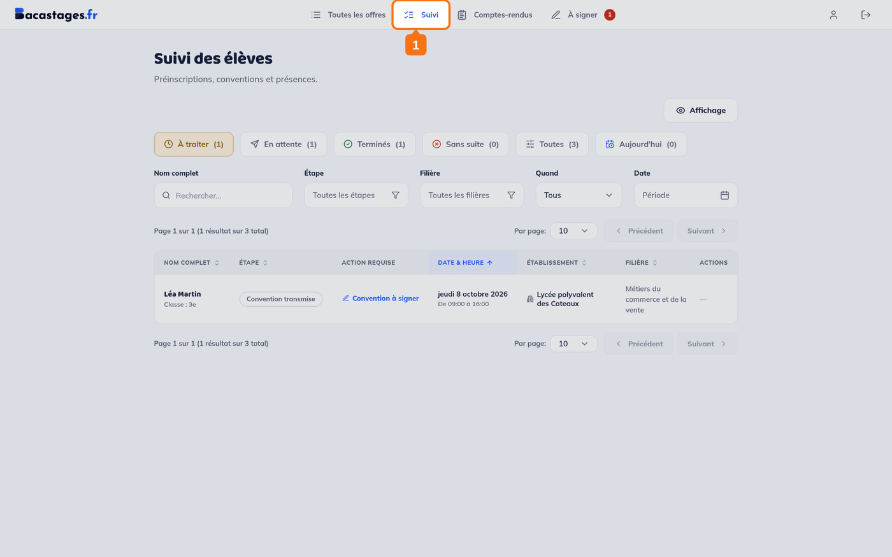
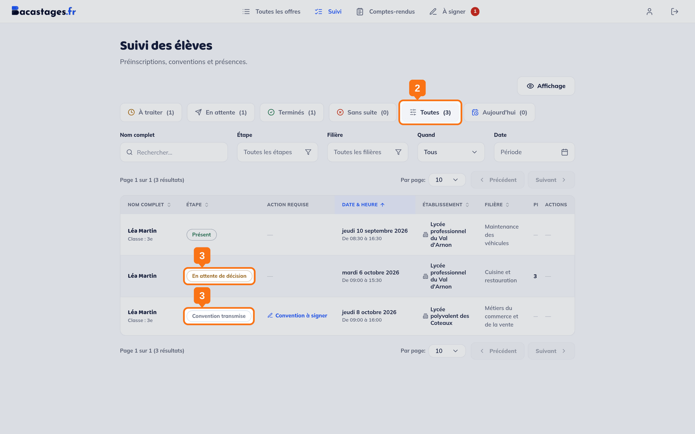
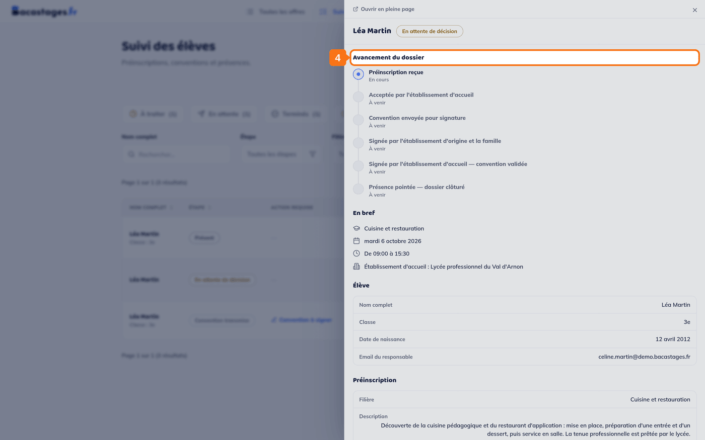
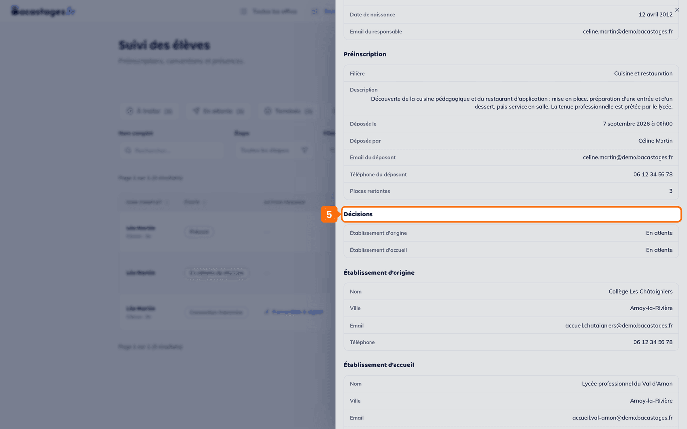

## Objectif

Savoir où en est chaque demande que vous avez envoyée.

## Ce qu'il vous faut

- Un compte famille connecté
- Au moins une demande envoyée

---

## 1. Ouvrir la rubrique « Suivi »

Cliquez sur **« Suivi »** dans la navigation.

> **Il n'y a plus de rubrique « Préinscriptions ».** Elle a été fusionnée dans **« Suivi »**, qui réunit désormais les préinscriptions, les conventions et les présences. Un ancien lien vers `/preregistrations` vous y renvoie tout seul.

## 2. Choisir ce que vous voulez voir

Six onglets, chacun avec son compte : **À traiter**, **En attente**, **Terminés**, **Sans suite**, **Toutes**, **Aujourd'hui**.

> **« Toutes » est le bon onglet pour faire le point** : il met côte à côte toutes les demandes de votre enfant, quelle que soit leur avancée.

## 3. Lire l'étape de chaque dossier

La colonne **« Étape »** dit où en est le dossier. Elle ne compte pas trois statuts mais sept, dans cet ordre :

| Étape | Ce que cela veut dire |
|---|---|
| **En attente de décision** | Au moins un des deux établissements n'a pas encore répondu |
| **Convention transmise** | Les deux ont accepté, la convention est partie |
| **Convention à signer** | Elle attend une signature |
| **Convention validée** | Le lycée d'accueil l'a validée |
| **Présent** ou **Absent** | La présence a été pointée, le dossier est clos |
| **Refusée** | L'un des deux établissements a refusé |
| **Désinscrit** | Votre enfant a été retiré du mini-stage |

> Une colonne **« Action requise »** signale, à côté, ce qui attend quelque chose de vous.

## 4. Ouvrir le détail d'une demande

Cliquez sur la ligne : un panneau s'ouvre sur la droite. **« Avancement du dossier »** en tête déroule les six jalons du circuit, chacun marqué *Étape complétée*, *En cours* ou *À venir*.

## 5. Voir laquelle des deux réponses manque

Plus bas dans le même panneau, le bloc **« Décisions »** donne les deux séparément : **« Établissement d'origine »** et **« Établissement d'accueil »**, chacun avec sa réponse.

> **C'est le seul endroit qui le dise.** La pastille « En attente de décision » de la liste ne distingue pas les deux.

---

## Vous êtes prévenu par e-mail

Un e-mail part à chaque changement de statut, depuis **team@notif.bacastages.fr**.

> Si vous ne recevez rien, vérifiez votre courrier indésirable — et voyez l'article **« Je ne reçois pas les emails de Bacastages »**.

---

## En cas de refus

**Lisez le motif** : il vient de l'établissement qui a refusé et vous dit souvent quoi faire.

Vous pouvez ensuite envoyer une demande sur **une autre offre**. Un refus ne vous ferme aucune porte.

> **Un refus peut être annulé.** Tant que le second établissement n'a pas tranché, le premier peut revenir sur sa décision : si le motif vous paraît reposer sur un malentendu, dites-le à l'établissement concerné.

---

## Si rien ne bouge

Une demande peut rester « En attente de décision » plusieurs jours : deux établissements doivent la voir passer. Au-delà d'une semaine, contactez directement celui de votre enfant : c'est en général le premier à devoir se prononcer.

---

## Une fois la demande validée

Une convention est générée. Voyez **« Déposer la convention signée de votre enfant »**.

---

## Besoin d'aide ?

- **Par email :** [support@bacastages.fr](mailto:support@bacastages.fr)
- **Par le chat :** la bulle en bas à droite de votre écran
