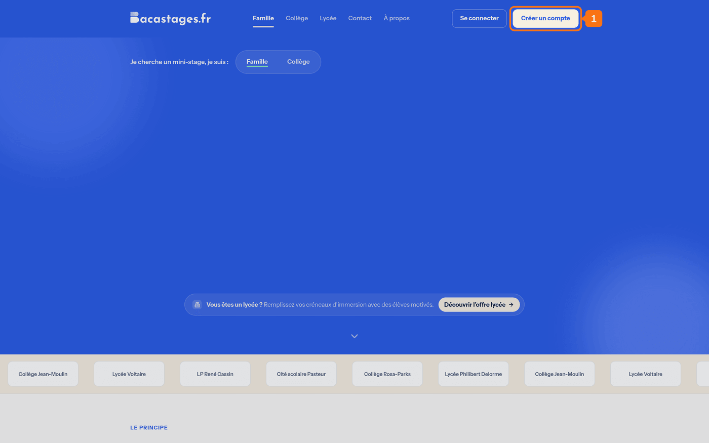
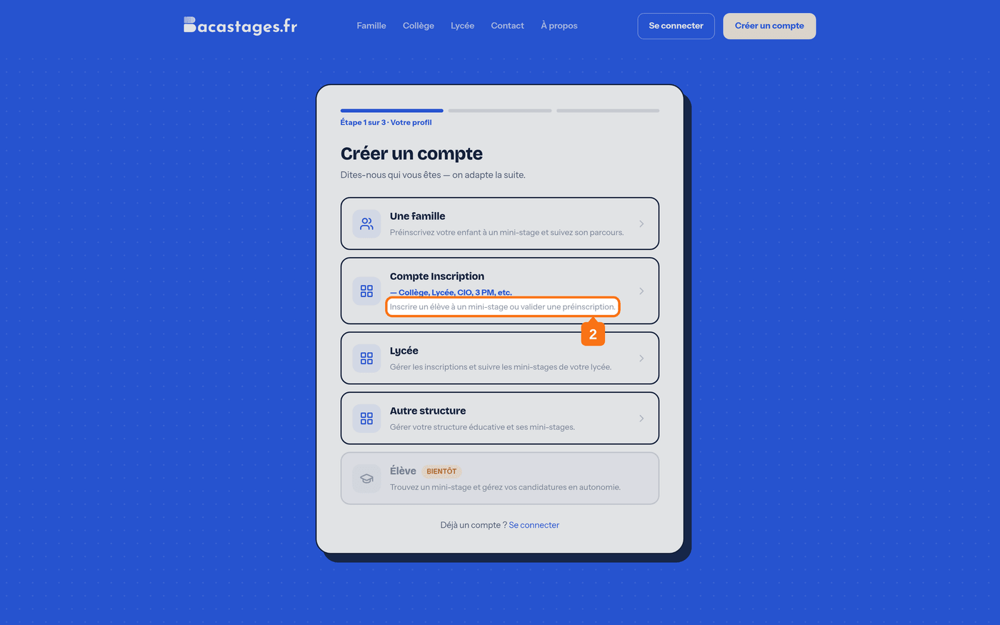
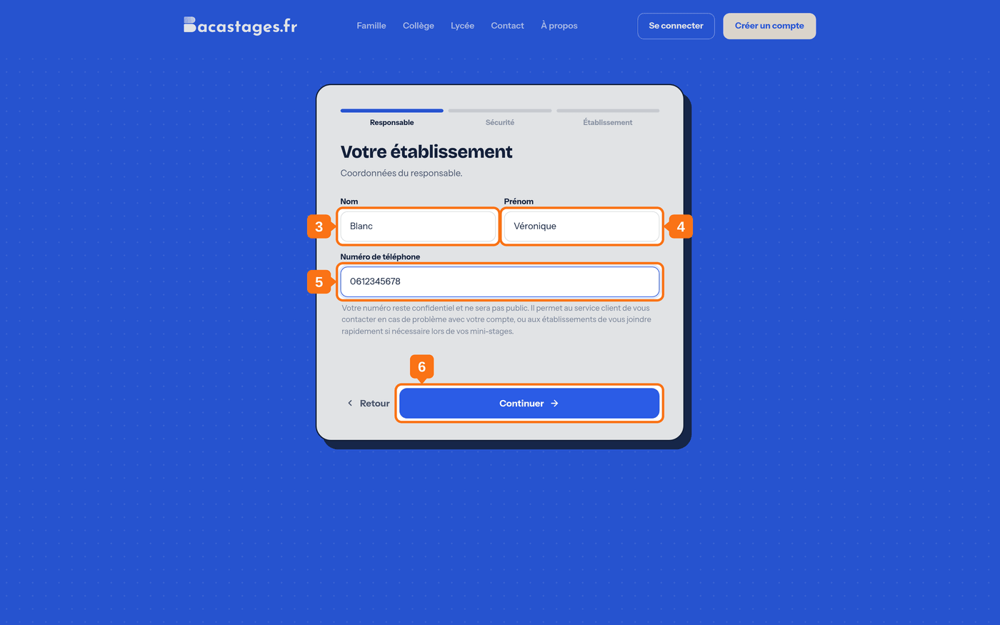
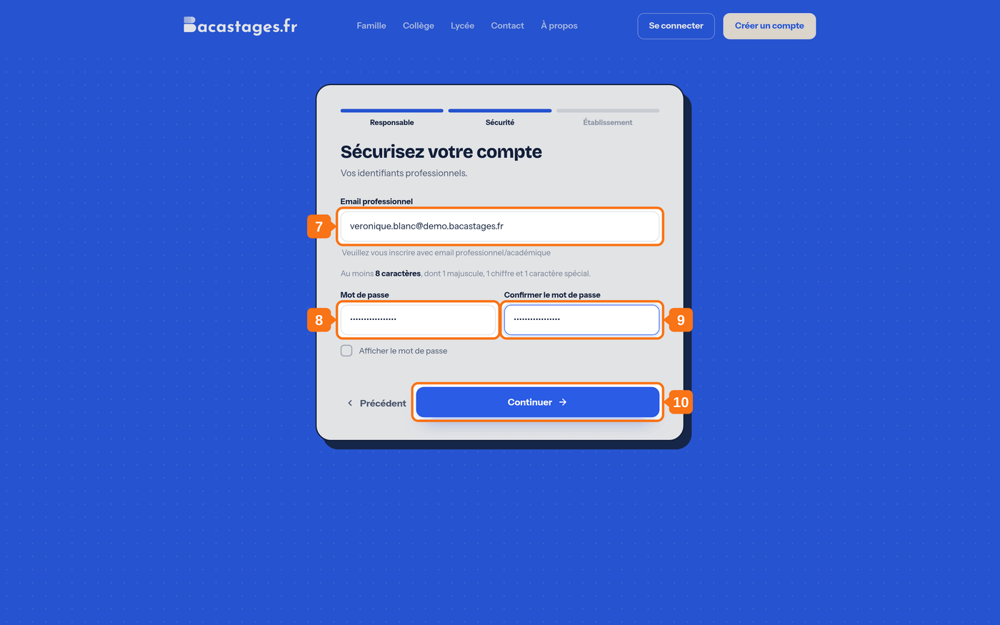
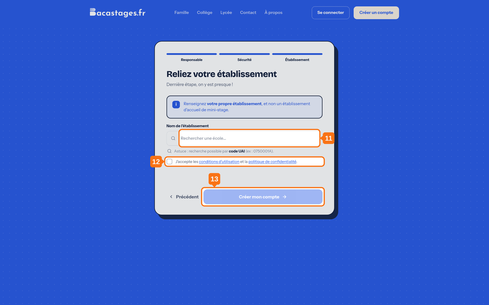

## Objectif

Créer votre compte Bacastages pour inscrire les élèves de votre établissement en mini-stage, et suivre leurs dossiers.

Cet article s'adresse aux **collèges, CIO et structures qui inscrivent des élèves** (le « Compte Inscription »). Si vous êtes un lycée qui accueille des mini-stagiaires, suivez plutôt le parcours *DDF - ATDDF - BDE - Personnel de direction*.

## Ce qu'il vous faut

- Votre adresse email académique
- Le nom ou le code UAI de votre établissement
- Votre numéro de téléphone

---

## 1. Ouvrir la page d'inscription

Rendez-vous sur **Bacastages.fr**, puis cliquez sur **« Créer un compte »**, en haut à droite.

## 2. Choisir le profil « Compte Inscription »

L'écran affiche **« Étape 1 sur 3 · Votre profil »**.

Cliquez sur la carte **« Compte Inscription »**, décrite par *« Collège, Lycée, CIO, 3 PM, etc. »*.

> Ne choisissez pas la carte **« Lycée »** : elle est réservée aux établissements qui *accueillent* des mini-stagiaires et proposent des offres. La carte **« Compte Inscription »** est celle des établissements qui *envoient* leurs élèves.

---

La suite compte trois volets, franchis l'un après l'autre : **Responsable**, **Sécurité**, **Établissement**.

## 3. Saisir votre nom

## 4. Saisir votre prénom

## 5. Saisir votre numéro de téléphone

Sans espace entre les chiffres, par exemple `0612345678`.

> Votre numéro reste confidentiel. Il sert au service client à vous joindre, et aux établissements à vous contacter pendant un mini-stage.

## 6. Continuer

---

## 7. Saisir votre adresse email

Utilisez votre **adresse professionnelle ou académique** : l'écran la réclame explicitement, et elle accélère la validation de votre compte.

## 8. Choisir votre mot de passe

**Au moins 8 caractères, dont 1 majuscule, 1 chiffre et 1 caractère spécial.**

## 9. Confirmer votre mot de passe

## 10. Continuer

---

## 11. Trouver votre établissement

Recherchez-le par son **nom** ou par son **code UAI**, puis sélectionnez-le dans la liste.

> **Renseignez votre propre établissement**, et non un lycée qui accueille des mini-stages.

## 12. Accepter les conditions d'utilisation

Cochez la case **« J'accepte les conditions d'utilisation et la politique de confidentialité »**. Sans elle, le compte ne peut pas être créé.

## 13. Créer votre compte

Cliquez sur **« Créer mon compte »**.

---

## 14. Activer votre compte

Une fenêtre de confirmation s'affiche. **Restez sur cette page.**

Ouvrez votre boîte mail, puis l'email de Bacastages, et cliquez sur le lien d'activation qu'il contient.

## 15. Confirmer votre adresse

Le lien vous ramène sur Bacastages. Cliquez sur **« Confirmer mon email »**.

---

## Vous n'avez pas reçu l'email ?

- Vérifiez votre dossier de courrier indésirable.
- Revenez sur la page de confirmation, restée ouverte, et cliquez sur **« Renvoyer un email »**.
- Les emails de Bacastages partent de l'adresse **team@notif.bacastages.fr** : autorisez-la si votre établissement filtre les expéditeurs.

## Et ensuite ?

Votre compte est actif. Il reste **deux informations à renseigner** avant de pouvoir inscrire un élève : voir *2. Configuration de votre établissement*.

---

**Besoin d'aide ?** Écrivez à **[support@bacastages.fr](mailto:support@bacastages.fr)**, ou utilisez la bulle de chat en bas à droite de l'écran.
