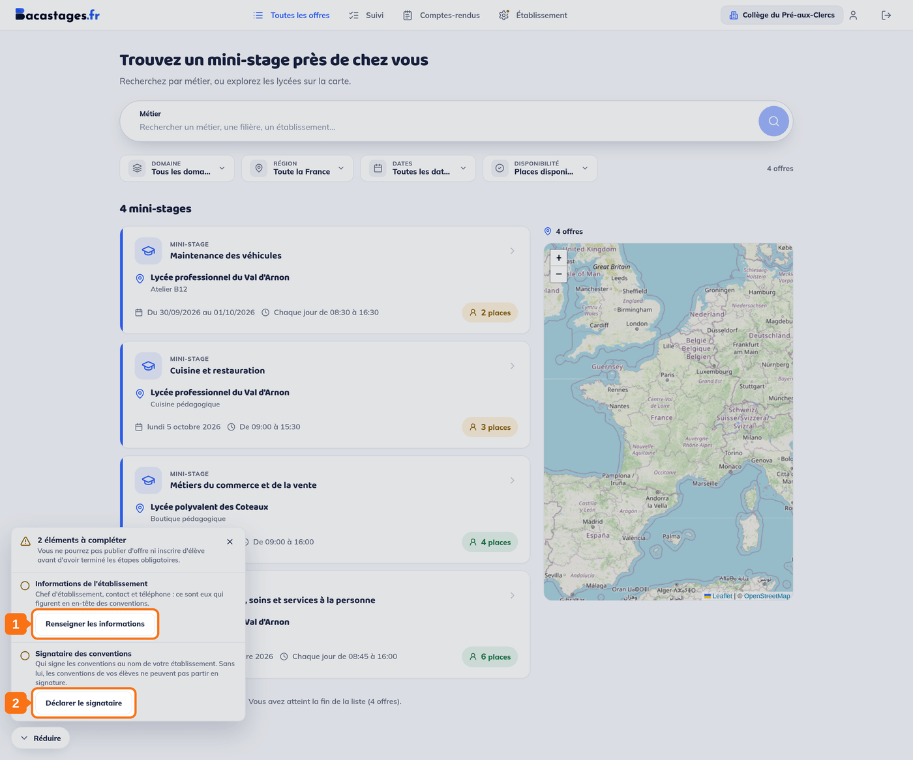
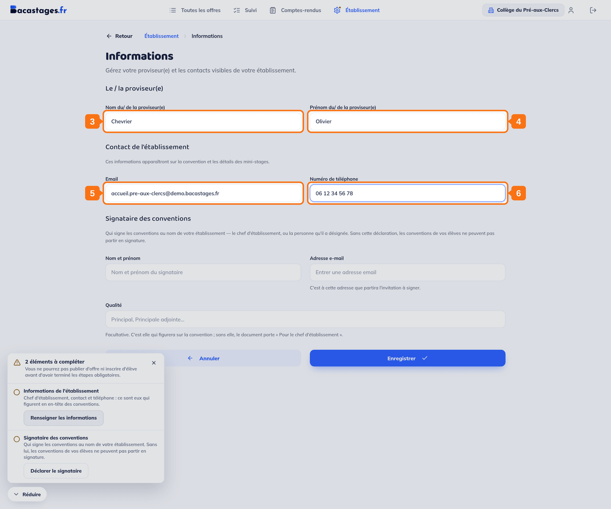
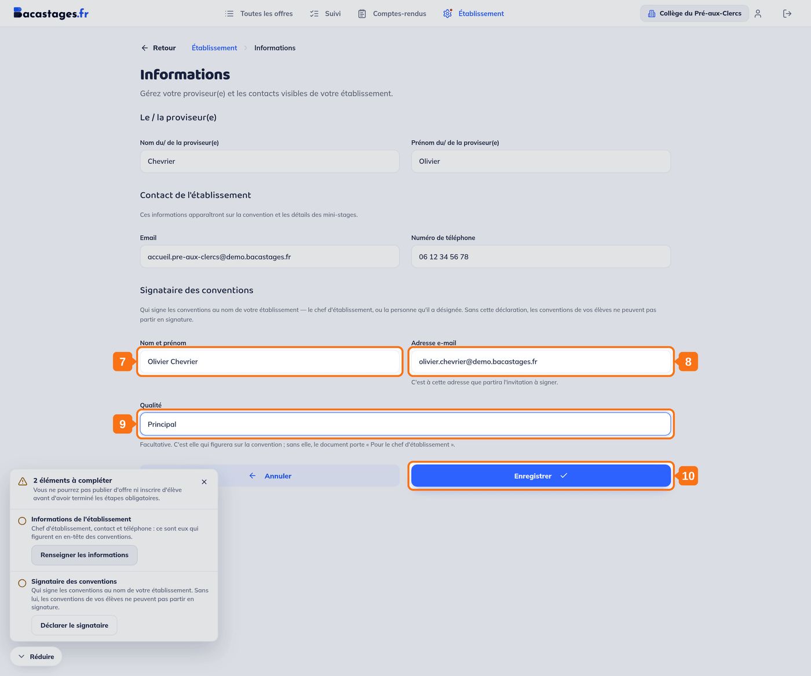

## Objectif

Renseigner les **deux informations** que Bacastages demande à votre établissement avant que vous puissiez inscrire un élève.

Cet article s'adresse aux **collèges, CIO et structures qui inscrivent des élèves** (le « Compte Inscription »).

## Ce qu'il vous faut

- Un compte créé et son adresse email confirmée
- Le nom et les coordonnées de votre chef d'établissement
- Le nom et l'adresse email de la personne qui signera les conventions

---

## Vue d'ensemble

À votre première connexion, un panneau **« Mise en place »** s'ouvre en bas à gauche et liste ce qui reste à faire. Pour un établissement qui inscrit des élèves, il compte **deux étapes**, toutes deux bloquantes :

1. **Informations de l'établissement**
2. **Signataire des conventions**

Tant qu'elles ne sont pas complètes, le panneau le dit sans détour : *« Vous ne pourrez pas publier d'offre ni inscrire d'élève avant d'avoir terminé les étapes obligatoires. »*

> **Les deux étapes mènent au même écran.** « Renseigner les informations » et « Déclarer le signataire » ouvrent tous deux la page **Établissement › Informations**, et un seul **« Enregistrer »** valide les deux. Vous pouvez donc tout faire en une fois.

> Le panneau se replie par **« Réduire »** et se rouvre quand vous le souhaitez : il retient ce qui est déjà fait.

---

## 1. Ouvrir l'étape « Informations de l'établissement »

Dans le panneau de mise en place, cliquez sur **« Renseigner les informations »**.

## 2. Ou ouvrir directement l'étape « Signataire des conventions »

Le lien **« Déclarer le signataire »** ouvre le même écran, plus bas. Peu importe par lequel vous commencez.

---

## 3. Saisir le nom du chef d'établissement

## 4. Saisir son prénom

> L'écran intitule cette section **« Le / la proviseur(e) »** quel que soit votre type d'établissement. Pour un collège, il s'agit bien de votre principal ou principale.

## 5. Saisir l'adresse email de contact

## 6. Saisir le numéro de téléphone

> Ces informations ne sont pas décoratives : **elles figurent en en-tête des conventions** que signeront les familles et le lycée d'accueil, et sur les détails des mini-stages.

---

## 7. Saisir le nom et le prénom du signataire

Le chef d'établissement, ou la personne qu'il a désignée.

## 8. Saisir son adresse email

**C'est à cette adresse que partira l'invitation à signer.** Vérifiez-la.

## 9. Saisir sa qualité

*Principal, Principale adjointe…* Ce champ est **facultatif** : sans lui, la convention porte la mention « Pour le chef d'établissement ».

## 10. Enregistrer

Cliquez sur **« Enregistrer »**. Les deux étapes sont comptées comme faites, et le panneau de mise en place n'affiche plus d'étape bloquante.

> **Pourquoi le signataire est obligatoire.** Une convention de mini-stage est signée par trois parties : la famille, le lycée qui accueille, et votre établissement. Sans signataire déclaré, **les conventions de vos élèves ne peuvent pas partir en signature**.

---

## Vous y êtes

Votre établissement est configuré. Vous pouvez inscrire vos élèves en mini-stage et suivre leurs dossiers depuis l'entrée **« Suivi »** de la barre du haut.

## Modifier ces informations plus tard

Cet écran reste accessible à tout moment par l'entrée **« Établissement »** de la barre du haut, sur la carte **« Informations de l'établissement »**.

---

## Besoin d'aide ?

- **Par email :** [support@bacastages.fr](mailto:support@bacastages.fr)
- **Par le chat :** la bulle en bas à droite de votre écran
