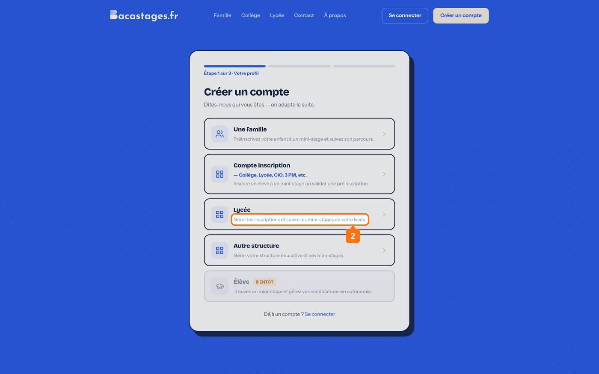
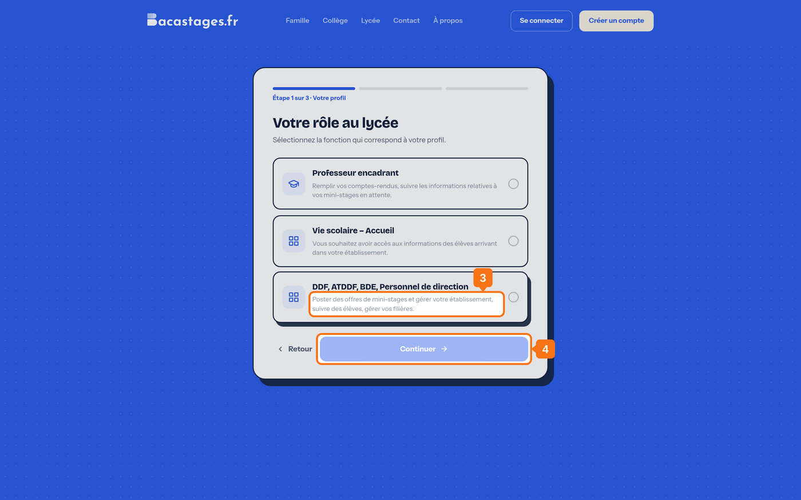
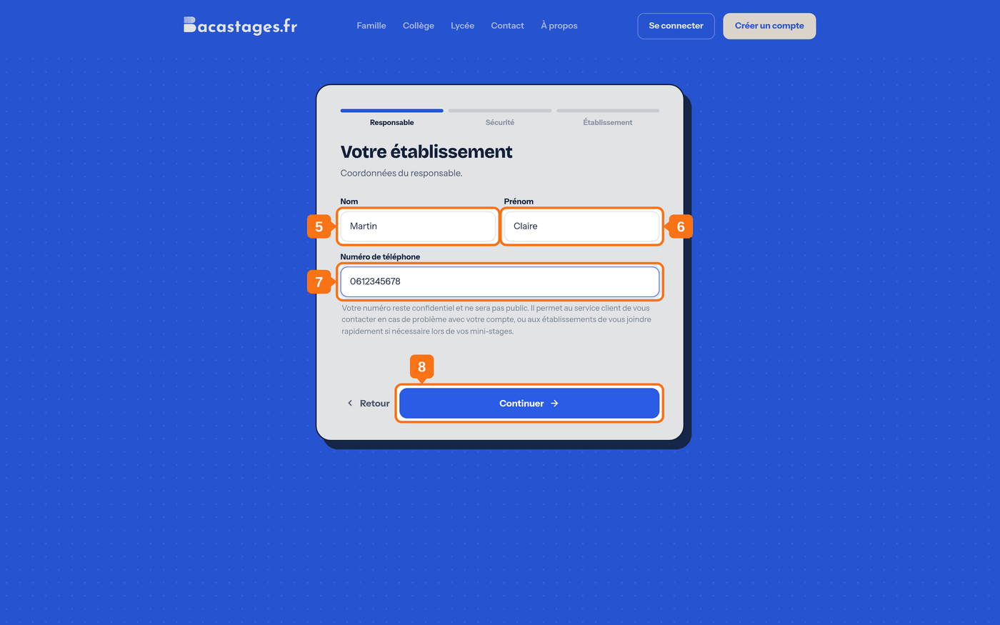
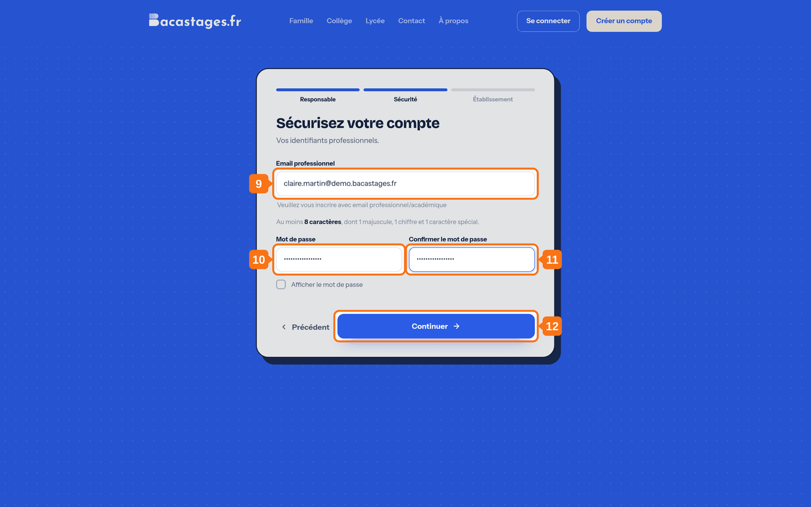
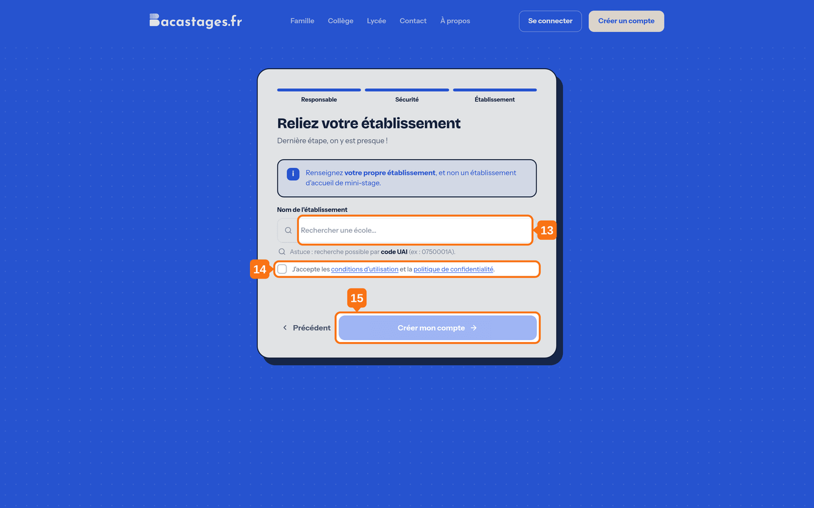

## Objectif

Créer votre compte Bacastages pour publier des offres de mini-stage et gérer votre lycée.

Cet article s'adresse aux **DDF, ATDDF, BDE et personnels de direction d'un lycée**. Si vous êtes professeur encadrant, ou si vous inscrivez des élèves depuis un collège ou un CIO, votre parcours est différent.

## Ce qu'il vous faut

- Votre adresse email académique
- Le nom ou le code UAI de votre lycée
- Votre numéro de téléphone

---

## 1. Ouvrir la page d'inscription

Rendez-vous sur **Bacastages.fr**, puis cliquez sur **« Créer un compte »**, en haut à droite.

## 2. Choisir le profil « Lycée »

L'écran affiche **« Étape 1 sur 3 · Votre profil »**.

Cliquez sur la carte **« Lycée »**, décrite par *« Gérer les inscriptions et suivre les mini-stages de votre lycée »*.

## 3. Choisir votre rôle au lycée

L'écran suivant s'intitule **« Votre rôle au lycée »** et propose trois cartes.

Cliquez sur **« DDF, ATDDF, BDE, Personnel de direction »**.

> Les deux autres cartes ouvrent des accès plus étroits : **« Professeur encadrant »** pour remplir des comptes rendus et suivre ses propres mini-stages, **« Vie scolaire – Accueil »** pour consulter les informations des élèves qui arrivent. Seul le profil DDF permet de publier des offres et de configurer l'établissement.

## 4. Continuer

---

La suite du formulaire compte trois volets, que vous franchissez l'un après l'autre : **Responsable**, **Sécurité**, **Établissement**.

## 5. Saisir votre nom

## 6. Saisir votre prénom

## 7. Saisir votre numéro de téléphone

Sans espace entre les chiffres, par exemple `0612345678`.

> Votre numéro reste confidentiel. Il sert au service client à vous joindre, et aux établissements à vous contacter pendant un mini-stage.

## 8. Continuer

---

## 9. Saisir votre adresse email

Utilisez votre **adresse professionnelle ou académique** : l'écran la réclame explicitement, et elle accélère la validation de votre compte.

## 10. Choisir votre mot de passe

**Au moins 8 caractères, dont 1 majuscule, 1 chiffre et 1 caractère spécial.**

## 11. Confirmer votre mot de passe

> La case **« Afficher le mot de passe »** vous permet de vérifier votre saisie avant de continuer.

## 12. Continuer

---

## 13. Trouver votre lycée

Recherchez-le par son **nom** ou par son **code UAI**, puis sélectionnez-le dans la liste.

> **Renseignez votre propre établissement**, et non un lycée qui accueille des mini-stages.

## 14. Accepter les conditions d'utilisation

Cochez la case **« J'accepte les conditions d'utilisation et la politique de confidentialité »**. Sans elle, le compte ne peut pas être créé.

## 15. Créer votre compte

Cliquez sur **« Créer mon compte »**.

---

## 16. Activer votre compte

Une fenêtre de confirmation s'affiche. **Restez sur cette page.**

Ouvrez votre boîte mail, puis l'email de Bacastages, et cliquez sur le lien d'activation.

## 17. Confirmer votre adresse

Le lien vous ramène sur Bacastages. Cliquez sur **« Confirmer mon email »**.

---

## Vous n'avez pas reçu l'email ?

- Vérifiez votre dossier de courrier indésirable.
- Revenez sur la page de confirmation, restée ouverte, et cliquez sur **« Renvoyer un email »**.
- Les emails de Bacastages partent de l'adresse **team@notif.bacastages.fr** : autorisez-la si votre établissement filtre les expéditeurs.

## Et ensuite ?

Votre compte est actif. La mise en place de votre établissement se fait en six étapes : voir *2. Configuration de votre établissement — Partie 1*.

---

**Besoin d'aide ?** Écrivez à **[support@bacastages.fr](mailto:support@bacastages.fr)**, ou utilisez la bulle de chat en bas à droite de l'écran.
