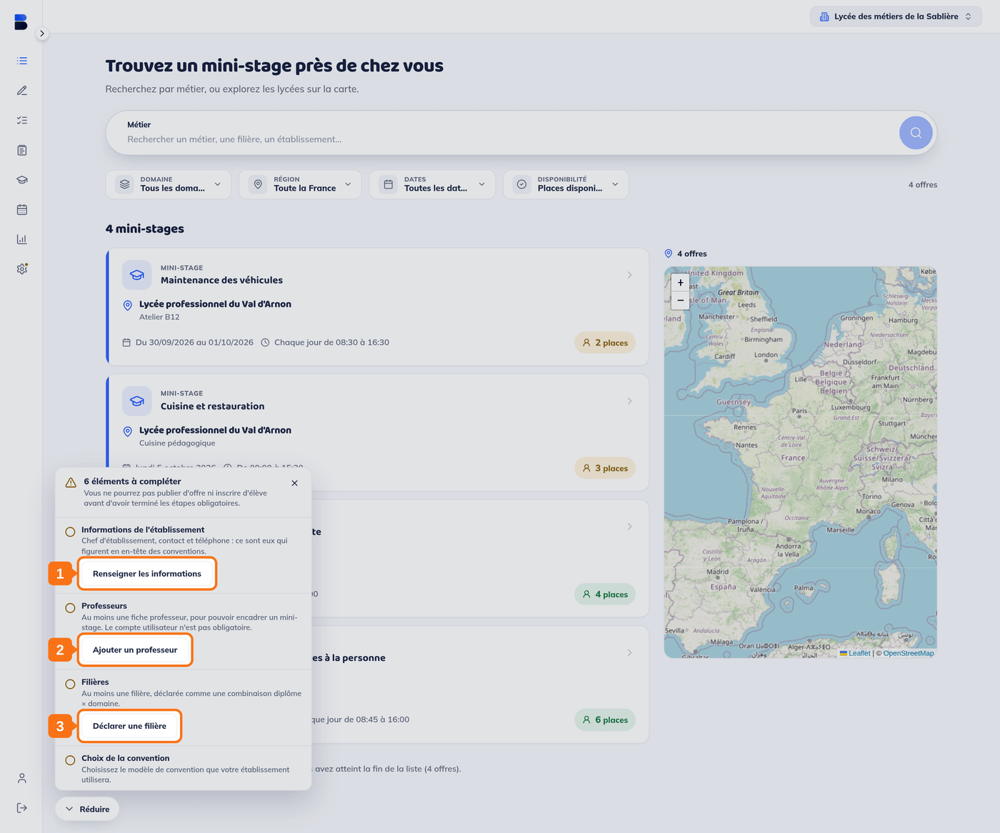
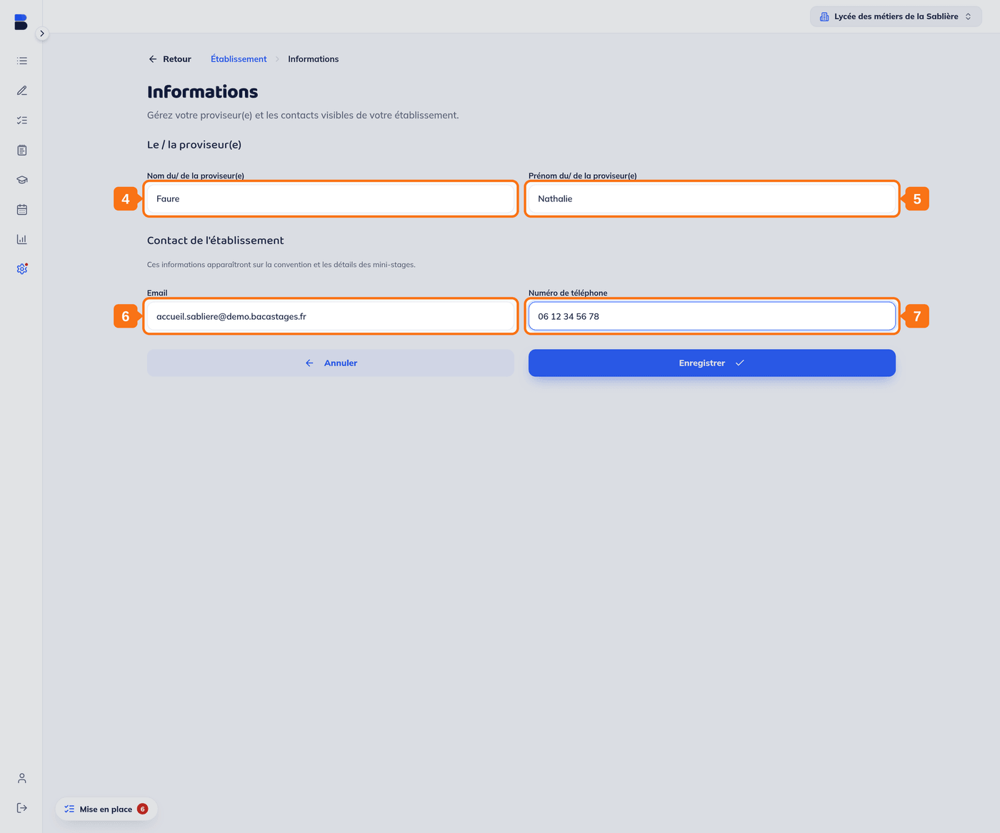
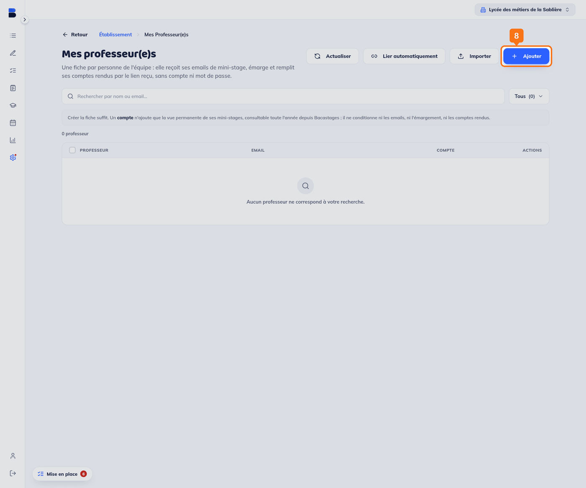
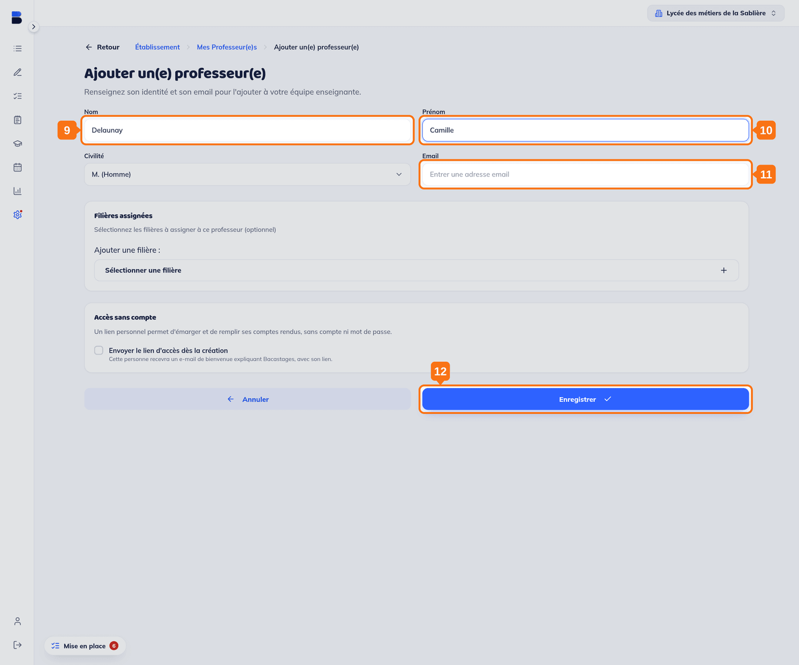
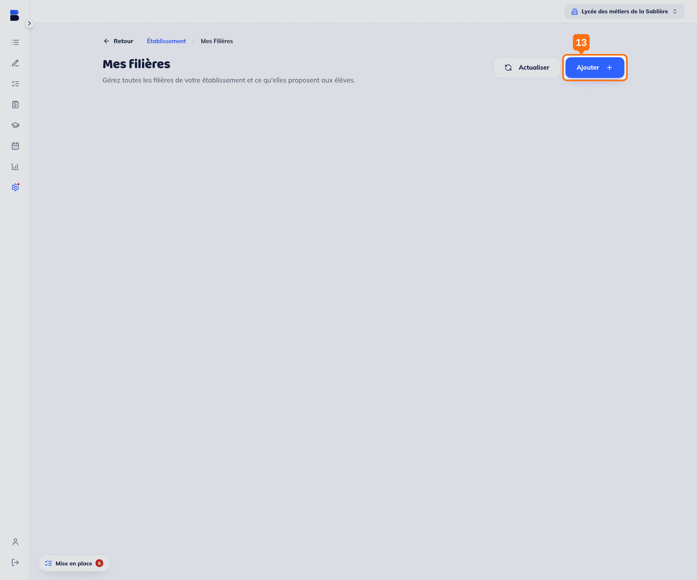
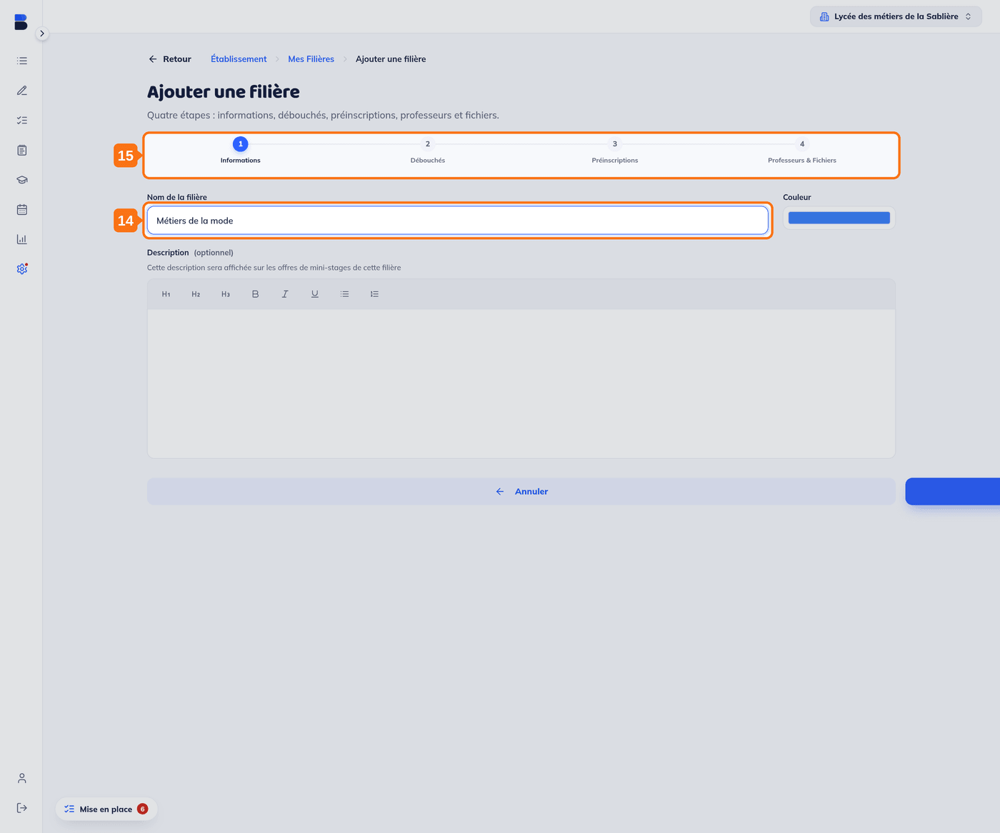

## Objectif

Comprendre le panneau de mise en place de votre lycée, et franchir ses **trois premières étapes**.

Cet article s'adresse aux **DDF, ATDDF, BDE et personnels de direction d'un lycée**.

## Ce qu'il vous faut

- Un compte créé et son adresse email confirmée
- **Un abonnement actif** (voir l'encadré ci-dessous)
- Le nom et les coordonnées de votre chef d'établissement
- Le nom d'au moins un professeur
- Au moins une filière que vous ouvrez aux mini-stagiaires

---

## Vue d'ensemble

À votre connexion, un panneau **« Mise en place »** s'ouvre en bas à gauche et liste ce qui reste à faire. Pour un lycée abonné, il compte **six étapes** :

1. **Informations de l'établissement**
2. **Professeurs**
3. **Filières**
4. **Choix de la convention**
5. **Méthode de signature** *(optionnel)*
6. **Présentation de l'établissement** *(optionnel)*

> **Vous n'en voyez que deux ?** Le panneau affiche ses six étapes une fois votre **abonnement actif**. Avant cela, il n'en demande que deux — *Informations de l'établissement* et *Signataire des conventions* — car les autres ne servent qu'à publier des offres, ce qu'un établissement sans abonnement ne fait pas.

Le panneau annonce ce qu'il bloque : *« Vous ne pourrez pas publier d'offre ni inscrire d'élève avant d'avoir terminé les étapes obligatoires. »* Les deux étapes marquées *(optionnel)* n'entrent pas dans ce blocage.

> Chaque étape optionnelle porte un bouton **« Marquer terminée »** : il la range sans rien renseigner, pour faire disparaître le rappel.

> Le panneau se replie par **« Réduire »** et se rouvre par la pastille **« Mise en place »** en bas à gauche. Il retient ce qui est déjà fait.

Cet article couvre les trois premières étapes. Les trois suivantes sont décrites dans *3. Configuration de votre établissement — Partie 2*.

---

## 1. Ouvrir l'étape « Informations de l'établissement »

Dans le panneau, cliquez sur **« Renseigner les informations »**.

## 2. Ouvrir l'étape « Professeurs »

Le lien **« Ajouter un professeur »** mène à la liste de vos professeurs.

## 3. Ouvrir l'étape « Filières »

Le lien **« Déclarer une filière »** mène à la liste de vos filières.

---

## 4. Saisir le nom du chef d'établissement

## 5. Saisir son prénom

## 6. Saisir l'adresse email de contact

## 7. Saisir le numéro de téléphone

Puis cliquez sur **« Enregistrer »**.

> Ces informations **figurent en en-tête des conventions** signées par les familles et les établissements d'origine, et sur les détails de vos mini-stages.

> Cet écran porte aussi le **signataire des conventions**, qui relève de l'étape *Méthode de signature* — vous pouvez le remplir dans la foulée, ou y revenir par la partie 2.

---

## 8. Ouvrir la fiche d'un nouveau professeur

Sur **Mes professeur(e)s**, cliquez sur **« Ajouter »**.

## 9. Saisir son nom

## 10. Saisir son prénom

## 11. Saisir son adresse email

## 12. Enregistrer

> **Une fiche n'est pas un compte.** La fiche sert à désigner qui encadre un mini-stage, et elle suffit pour publier une offre. Le panneau le dit : *« Le compte utilisateur n'est pas obligatoire. »* L'écran propose d'ailleurs un **accès sans compte**.

> Vous pouvez aussi lui **assigner des filières** — utile une fois l'étape suivante franchie.

---

## 13. Ouvrir la création d'une filière

Sur **Mes filières**, cliquez sur **« Ajouter »**.

## 14. Nommer la filière

## 15. Parcourir les quatre étapes

La création d'une filière est un assistant en quatre temps : **Informations**, **Débouchés**, **Préinscriptions**, **Professeurs & Fichiers**. Le premier écran demande le nom, une couleur et une description facultative — *« Cette description sera affichée sur les offres de mini-stages de cette filière »*.

Cliquez sur **« Suivant »** pour passer au suivant.

---

## Vous y êtes, à mi-chemin

Les trois premières étapes sont franchies. La suite — convention, signature, présentation publique — est décrite dans *3. Configuration de votre établissement — Partie 2*.

## Modifier ces informations plus tard

Tous ces écrans restent accessibles par l'entrée **« Établissement »** de la barre de gauche, sur les cartes **« Informations de l'établissement »**, **« Professeur(e)s »** et **« Filières »**.

---

## Besoin d'aide ?

- **Par email :** [support@bacastages.fr](mailto:support@bacastages.fr)
- **Par le chat :** la bulle en bas à droite de votre écran
