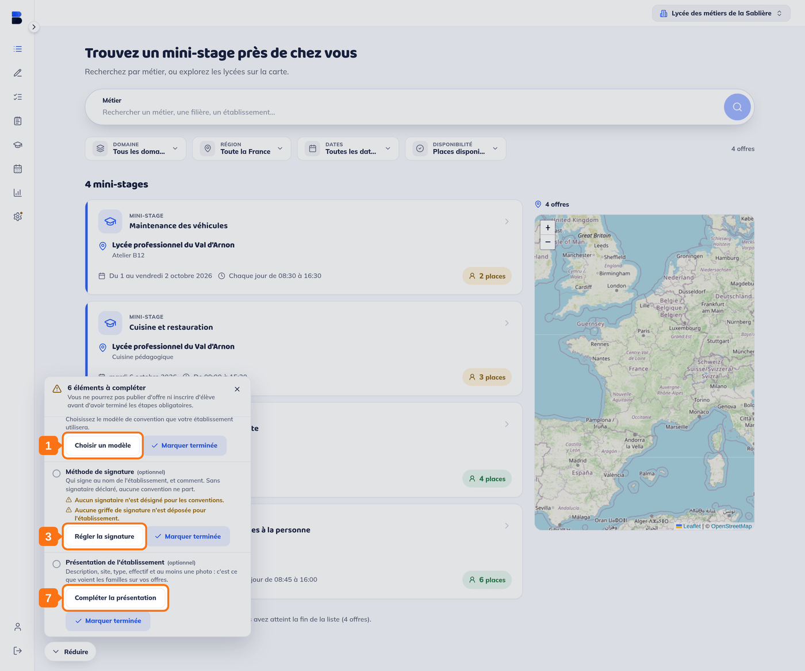
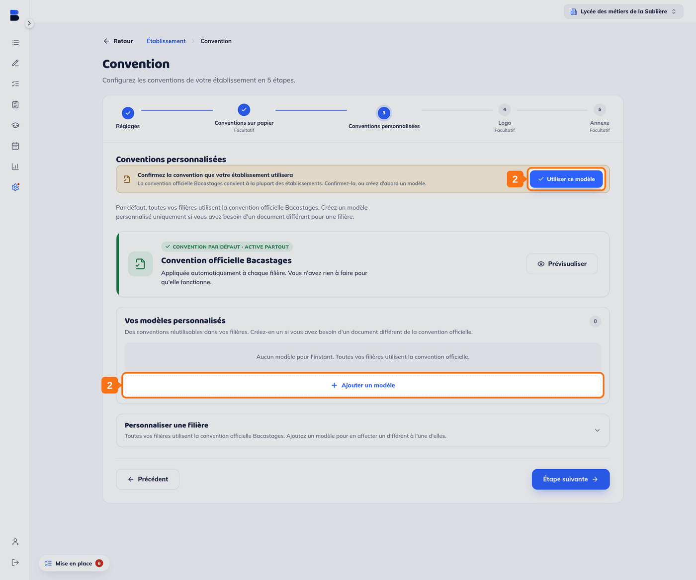
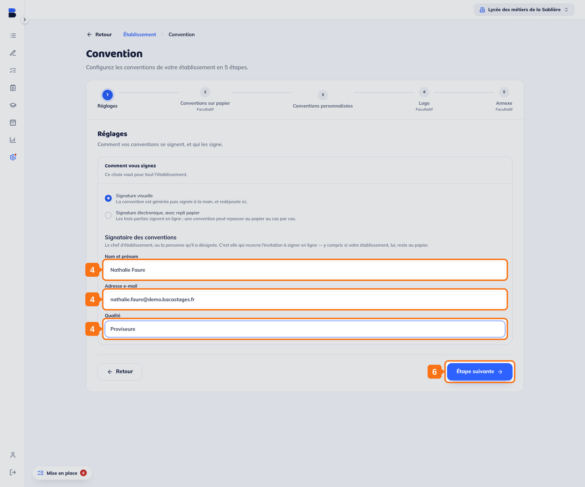
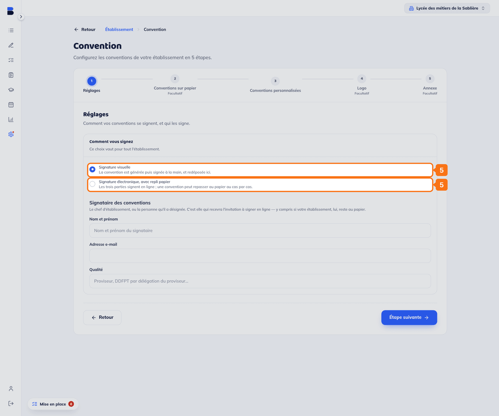
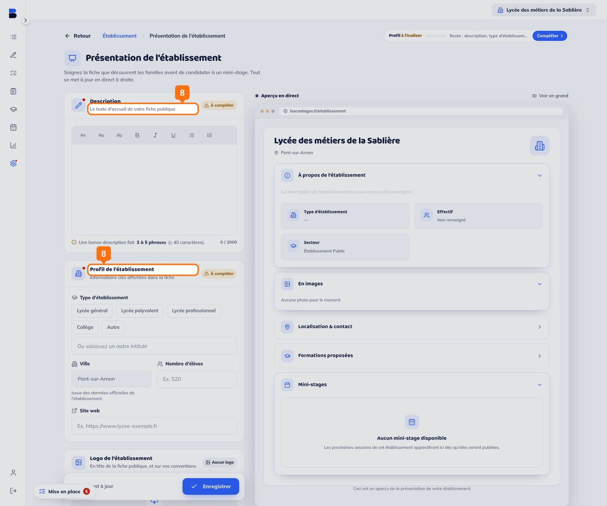
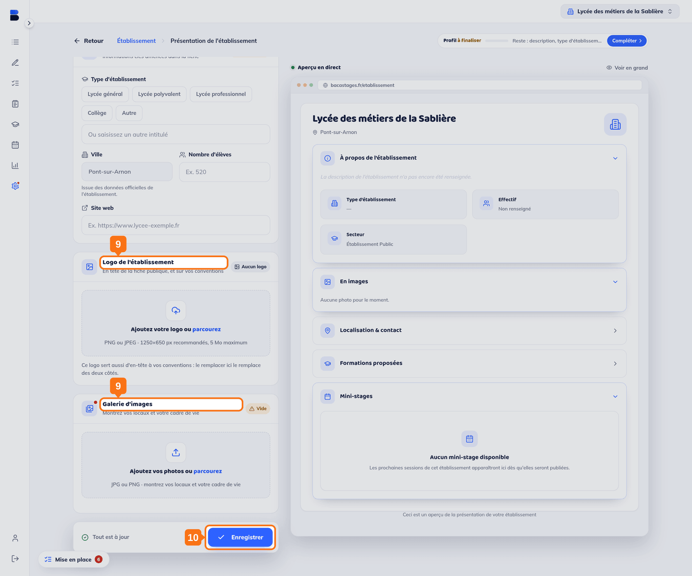

## Objectif

Franchir les **trois dernières étapes** de mise en place de votre lycée : la convention, la méthode de signature, et la présentation que liront les familles.

Cet article s'adresse aux **DDF, ATDDF, BDE et personnels de direction d'un lycée**. Il fait suite à *2. Configuration de votre établissement — Partie 1*.

## Ce qu'il vous faut

- Les trois premières étapes franchies
- Le nom, la qualité et l'adresse e-mail de la personne qui signe vos conventions
- Une description de votre lycée, votre logo et au moins une photo
- Si vous utilisez votre propre convention : le fichier PDF

---

## Vue d'ensemble

Les trois étapes de cet article se lancent depuis le panneau de mise en place, en bas à gauche.

> **Seule la première est obligatoire.** « Méthode de signature » et « Présentation de l'établissement » portent la mention **(optionnel)** et un bouton **« Marquer terminée »** : vous pouvez publier vos offres sans elles. Elles restent vivement conseillées, et la suite de cet article dit pourquoi.

---

## 1. Ouvrir l'étape « Choix de la convention »

Dans le panneau de mise en place, cliquez sur **« Choisir un modèle »**. Vous arrivez sur l'étape **« Conventions personnalisées »** de l'assistant Convention.

## 2. Confirmer votre modèle de convention

Deux possibilités :

- **Confirmer la convention officielle** en cliquant sur **« Utiliser ce modèle »**. C'est le choix le plus simple : elle est tenue à jour par Bacastages, et vous êtes prévenu quand une nouvelle version paraît.
- **Créer votre propre modèle** avec **« Ajouter un modèle »**, si vous avez besoin d'un document différent pour une filière.

> **La confirmation est un geste à part entière.** Toutes vos filières utilisent déjà la convention officielle, mais l'étape ne se compte comme faite que lorsque vous l'avez confirmée par **« Utiliser ce modèle »**.

> Si vous ajoutez votre propre modèle, une étape supplémentaire apparaîtra dans votre panneau de mise en place : **« Zones de signature »**. Elle vous demande d'indiquer sur le document où chaque partie signera. Sans ces zones, la signature électronique ne peut pas être activée.

---

## 3. Ouvrir l'étape « Méthode de signature »

De retour dans le panneau, cliquez sur **« Régler la signature »**. Vous arrivez sur l'étape **« Réglages »** de l'assistant Convention.

## 4. Déclarer qui signe au nom du lycée

Sous **« Signataire des conventions »**, renseignez **« Nom et prénom »**, **« Adresse e-mail »** et **« Qualité »** (proviseur, DDFPT par délégation du proviseur…).

> **Sans signataire déclaré, aucune convention ne part en signature électronique.** L'étape n'est pas bloquante, mais ce réglage-là l'est en pratique : si vous passez en signature en ligne, les trois champs deviennent obligatoires.

> C'est cette adresse qui recevra l'invitation à signer, **y compris si votre lycée reste au papier**. Vérifiez-la.

## 5. Choisir comment vous signez

Sous **« Comment vous signez »**, deux modes, et ce choix vaut pour tout l'établissement :

- **Signature visuelle** (le réglage par défaut) : la convention est générée, signée à la main, puis redéposée sur Bacastages.
- **Signature électronique, avec repli papier** : les trois parties signent en ligne, et une convention peut repasser au papier au cas par cas.

> **La signature électronique ne s'active pas au clic.** Cocher le second mode ne change rien encore : le réglage ne part qu'au moment où vous quittez l'étape, et Bacastages vous pose alors la question, **« Activer la signature électronique ? »**, en rappelant que les prochaines conventions partiront en ligne et que les familles et les établissements d'origine recevront une invitation à signer. Tant que vous n'avez pas confirmé, votre établissement reste au papier.
>
> Une fois l'activation enregistrée, l'assistant passe de cinq à six étapes, avec une étape **« Signature en ligne »** en plus.

> **Avant de généraliser la signature électronique, lancez une convention de test.** Un avertissement apparaît sous l'option dès que vous la cochez : elle s'appuie sur un modèle préparé pour votre établissement, et sans ce modèle, chaque lancement échouera.

## 6. Passer à l'étape suivante

Il n'y a pas de bouton « Enregistrer » sur cette étape : **« Étape suivante »** enregistre vos réglages en la quittant.

> L'assistant Convention compte d'autres étapes, facultatives ou réservées à un mode : **« Signature en ligne »** (ordre de sollicitation, mandats) n'apparaît qu'en signature électronique, **« Conventions sur papier »**, **« Logo »** et **« Annexe »** sont facultatives.

---

## 7. Ouvrir l'étape « Présentation de l'établissement »

De retour dans le panneau, cliquez sur **« Compléter la présentation »**.

## 8. Décrire votre lycée

Renseignez la **description**, puis, sous **« Profil de l'établissement »**, le **type d'établissement**, le **nombre d'élèves** et le **site web**.

> **Une bonne description fait trois à cinq phrases**, et le compteur du champ refuse en dessous de quarante caractères.

> La **ville** est déjà remplie : elle vient des données officielles de votre établissement et ne se saisit pas ici.

> **Tout se met à jour en direct** dans l'aperçu, à droite de l'écran. C'est exactement la fiche que découvriront les familles : lisez-la avant d'enregistrer.

## 9. Ajouter votre logo et au moins une photo

Deux blocs distincts, plus bas dans la même page :

- **Logo de l'établissement** : PNG ou JPEG, 1250 × 650 px conseillés, 5 Mo au maximum. **Ce logo sert aussi d'en-tête à vos conventions** : le remplacer ici le remplace des deux côtés.
- **Galerie d'images** : vos locaux et votre cadre de vie, en JPG ou PNG.

> **C'est ce que voient les familles** sur chacune de vos offres. Une photo et une description soignées font la différence au moment où une famille choisit entre plusieurs lycées.

## 10. Enregistrer

La dernière étape est comptée comme faite. Votre panneau de mise en place n'affiche plus d'étape en attente.

---

## Vous y êtes

Votre lycée est configuré. Vous pouvez publier vos premières offres : voir *4. Ajouter vos premières offres de mini-stage*.

## Modifier ces informations plus tard

Tous ces écrans restent accessibles par l'entrée **« Établissement »** de la barre de gauche :

| Pour modifier | Carte |
|---|---|
| Le signataire, le mode de signature, vos modèles | **Convention** |
| Ce que lisent les familles | **Présentation de l'établissement** |
| Vos professeurs | **Professeur(e)s** |
| Vos filières | **Filières** |

---

## Besoin d'aide ?

- **Par email :** [support@bacastages.fr](mailto:support@bacastages.fr)
- **Par le chat :** la bulle en bas à droite de votre écran
