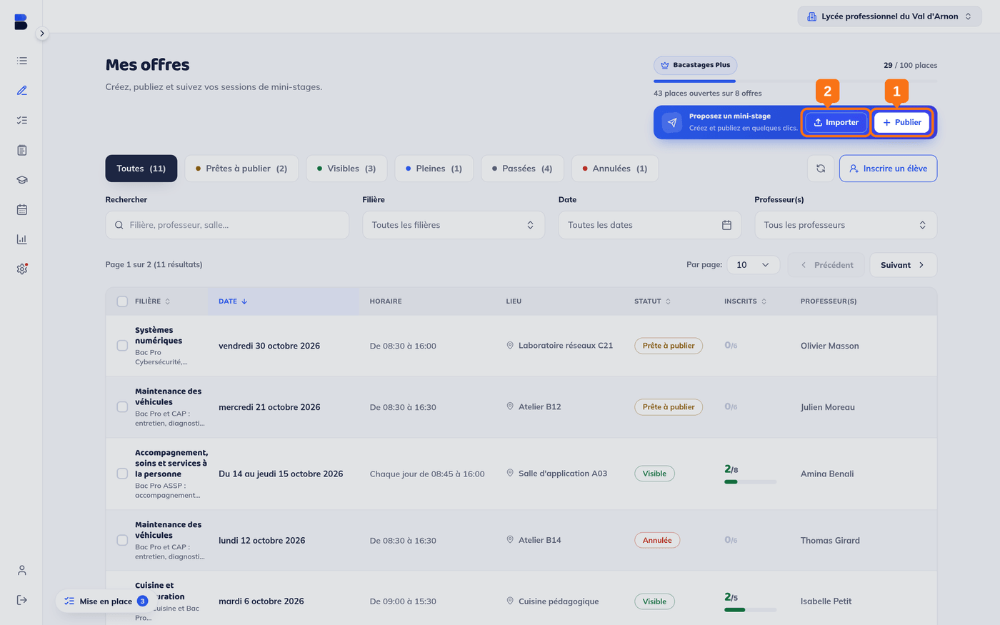
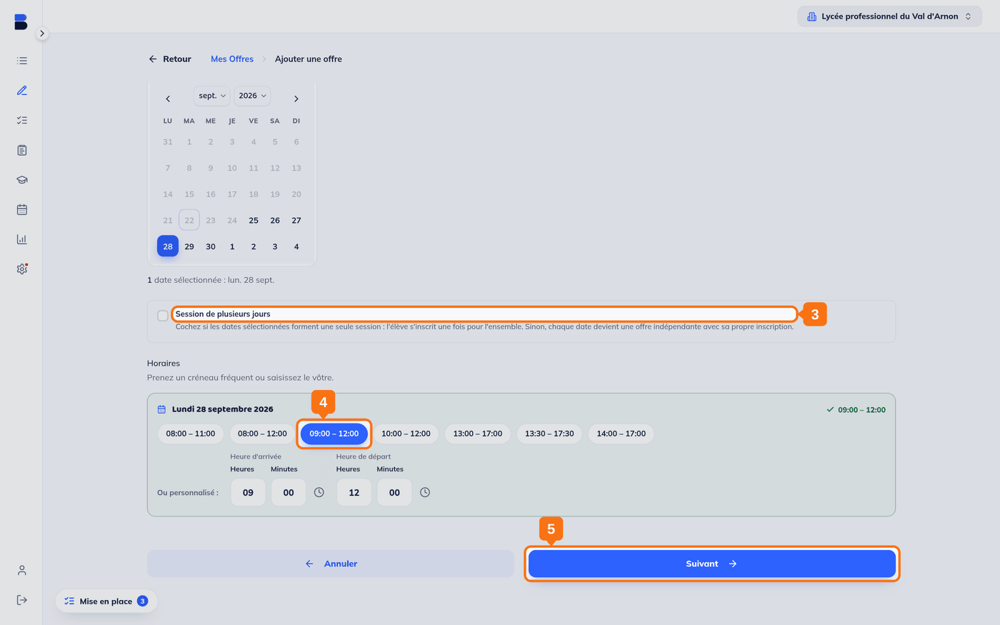
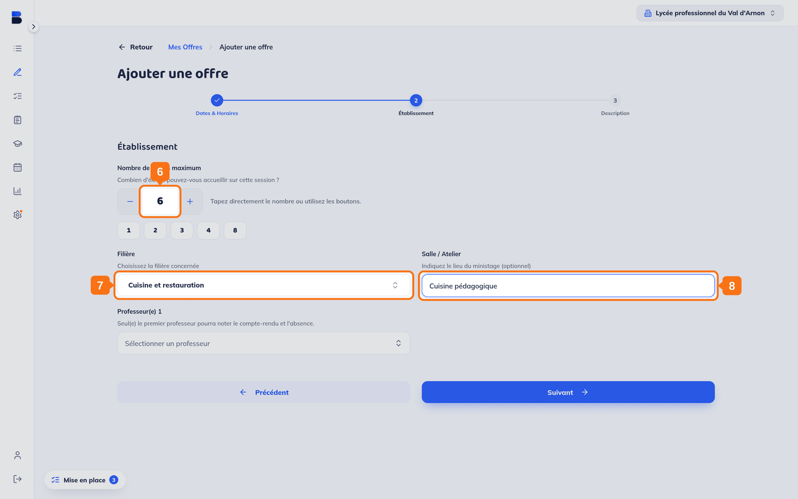
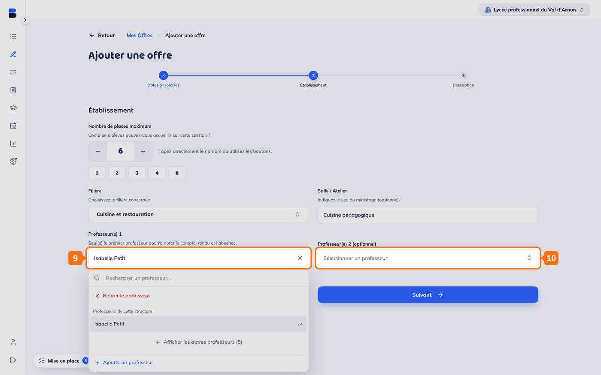
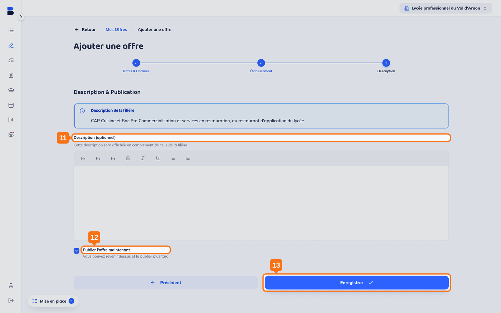
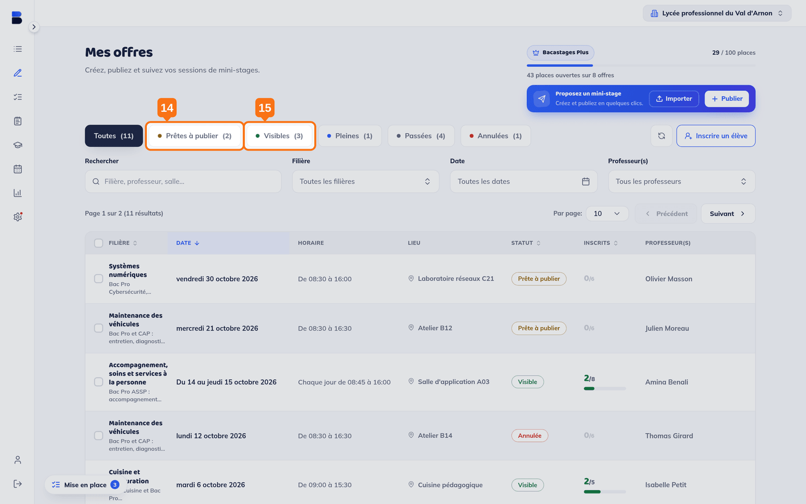

## Objectif

Publier une offre de mini-stage sur Bacastages.fr pour accueillir des collégiens dans votre établissement.

## Ce qu'il vous faut

- Un compte actif, connecté à Bacastages.fr
- Au moins une filière et un professeur déclarés : voir *2. Configuration de votre établissement, Partie 1*
- Les dates, l'horaire et le nombre de places du mini-stage

---

## 1. Ouvrir le formulaire de création

Dans **« Mes offres »**, la carte **« Proposez un mini-stage »** porte deux boutons :

- **« Publier »** ouvre le formulaire, une offre à la fois. C'est ce que décrit cet article.
- **« Importer »** charge un lot d'offres depuis un tableur, quand vous en avez plusieurs dizaines à créer.

> **Le formulaire tient en trois volets** : *Dates & Horaires*, *Établissement*, *Description*. Le fil en haut de l'écran dit toujours où vous en êtes, et **« Précédent »** revient en arrière sans rien perdre.

---

## Volet 1 : Dates & Horaires

## 2. Choisir une ou plusieurs dates

Cliquez sur chaque jour dans le calendrier. L'écran récapitule votre choix en dessous : *« 1 date sélectionnée »*, puis la liste.

## 3. Décider si les dates forment une seule session

La case **« Session de plusieurs jours »** change tout :

- **cochée**, les dates forment **une seule session** et l'élève s'inscrit une fois pour l'ensemble ;
- **décochée**, chaque date devient **une offre indépendante**, avec sa propre inscription.

## 4. Indiquer l'horaire

Chaque date a son bloc d'horaires. Prenez un des créneaux proposés (*08:00 à 11:00*, *09:00 à 12:00*, *13:30 à 17:30*…), ou saisissez le vôtre sous **« Ou personnalisé »**, en heure d'arrivée et heure de départ.

## 5. Continuer

---

## Volet 2 : Établissement

## 6. Renseigner le nombre de places

Tapez le nombre, utilisez les boutons plus et moins, ou prenez un des raccourcis proposés.

## 7. Choisir la filière

> **La filière commande la suite** : c'est elle qui fournit la description affichée aux familles, et c'est sur elle qu'est filtrée la liste des professeurs.

## 8. Préciser la salle ou l'atelier

Facultatif. Le lieu apparaît sur la fiche de l'offre, sous l'établissement.

## 9. Désigner le premier professeur

**Seul le premier professeur pourra noter le compte-rendu et l'absence.** Les suivants ne pourront qu'ajouter des commentaires.

> La liste ne propose d'abord que **les professeurs de la filière choisie**. **« Afficher les autres professeurs »** ouvre le reste de l'équipe, et **« Ajouter un professeur »** crée une fiche sans quitter durablement le formulaire.

## 10. Ajouter jusqu'à deux autres professeurs

Un champ **« Professeur(e) 2 (optionnel) »** apparaît dès que le premier est désigné, puis un troisième. Trois au maximum.

---

## Volet 3 : Description

## 11. Compléter la description (facultatif)

La **description de la filière** est rappelée en haut du volet : elle s'affiche toujours, vous n'avez rien à recopier. Le champ **« Description (optionnel) »** s'ajoute à elle, pour ce qui est propre à cette session : activités prévues, tenue à prévoir, consignes d'accueil.

## 12. Choisir le mode de publication

La case **« Publier l'offre maintenant »** est **cochée par défaut** :

- **laissée cochée**, l'offre devient visible par les collèges et les familles dès l'enregistrement ;
- **décochée**, elle est enregistrée en brouillon. *« Vous pouvez revenir dessus et la publier plus tard. »*

## 13. Enregistrer

Vous revenez à votre liste d'offres.

---

## Résultat attendu

Votre offre apparaît dans **« Mes offres »**, et les onglets disent où elle s'est rangée :

## 14. Une offre en brouillon se range dans « Prêtes à publier »

Vous pouvez encore la modifier, puis la publier quand vous le voulez.

## 15. Une offre publiée se range dans « Visibles »

Elle est immédiatement visible par les collèges et les familles, dans **« Toutes les offres »**.

> Les autres onglets suivent la vie de l'offre toute seule : **« Pleines »** quand il n'y a plus de place, **« Passées »** une fois la date franchie, **« Annulées »** si vous l'annulez.

---

## Conseils pratiques

✅ **Pour gagner du temps** : sélectionnez plusieurs dates dès la création si votre mini-stage se répète régulièrement, et laissez la case « Session de plusieurs jours » décochée pour obtenir autant d'offres indépendantes.

✅ **Description claire** : précisez les activités prévues pour aider les élèves à choisir un mini-stage adapté à leurs intérêts.

✅ **Mode brouillon** : décochez « Publier l'offre maintenant » si vous souhaitez valider les informations avec vos collègues avant publication.

---

## Besoin d'aide ?

Vous rencontrez une difficulté ? Contactez le support :

- **Email** : [support@bacastages.fr](mailto:support@bacastages.fr)
- **Chat en direct** : cliquez sur la bulle bleue en bas à droite de l'écran
