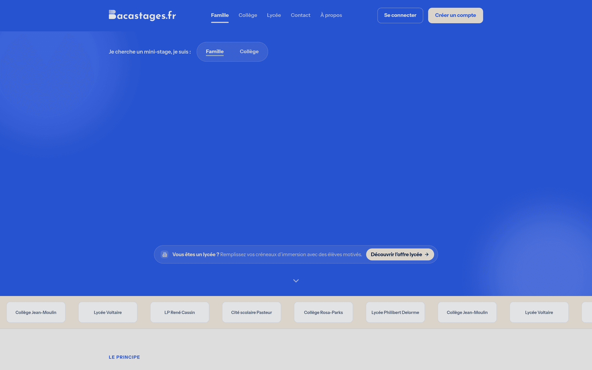
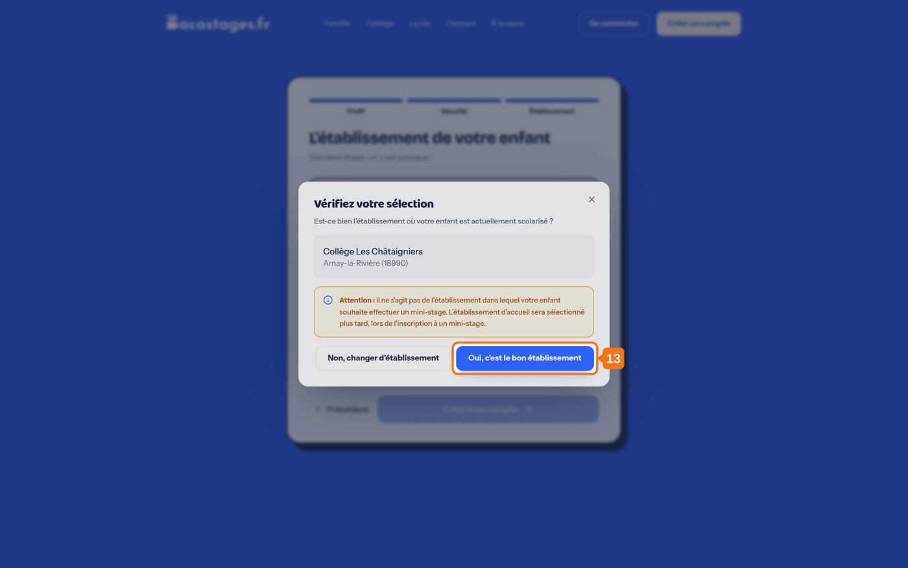
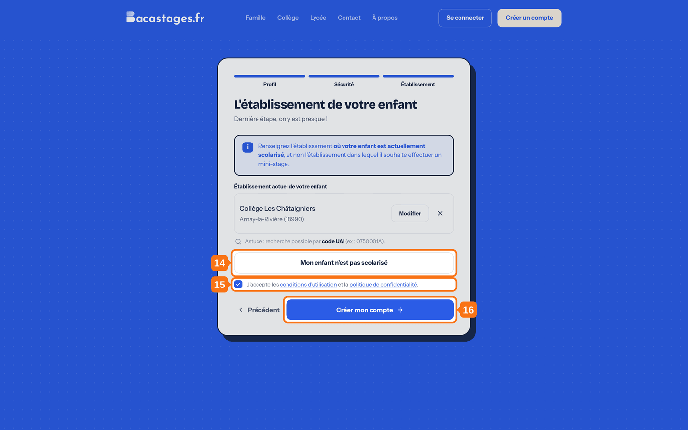

## Objectif

Créer votre compte parent sur Bacastages.fr pour préinscrire votre enfant à un mini-stage et suivre son parcours.

## Ce qu'il vous faut

- Une adresse email valide
- Le nom ou le code UAI de l'établissement où votre enfant est **actuellement** scolarisé
- Votre numéro de téléphone

---

## 1. Ouvrir la page d'inscription

Rendez-vous sur **Bacastages.fr**, puis cliquez sur **« Créer un compte gratuit »**.

## 2. Choisir le profil « Une famille »

L'écran affiche **« Étape 1 sur 3 · Votre profil »**.

Cliquez sur la carte **« Une famille »**, décrite par *« Préinscrivez votre enfant à un mini-stage et suivez son parcours »*.

> Les autres cartes sont réservées aux établissements. La carte **« Élève »** porte la mention **« Bientôt »** : un élève ne peut pas encore créer son propre compte, c'est à vous de l'inscrire depuis le vôtre.

---

La suite compte trois volets, franchis l'un après l'autre : **Profil**, **Sécurité**, **Établissement**.

> Vous ajouterez vos enfants **après** la création du compte, pas pendant.

## 3. Saisir votre nom

## 4. Saisir votre prénom

## 5. Saisir votre numéro de téléphone

Sans espace entre les chiffres, par exemple `0612345678`.

> Votre numéro reste confidentiel. Il sert au service client à vous joindre, et à l'établissement d'accueil à vous contacter pendant le mini-stage.

## 6. Continuer

---

## 7. Saisir votre adresse email

C'est elle qui vous servira d'identifiant pour vous connecter.

## 8. Choisir votre mot de passe

**Au moins 8 caractères, dont 1 majuscule, 1 chiffre et 1 caractère spécial.**

## 9. Confirmer votre mot de passe

> La case **« Afficher le mot de passe »** vous permet de vérifier votre saisie.

## 10. Continuer

---

## 11. Chercher l'établissement actuel de votre enfant

Saisissez son **nom** ou son **code UAI**. Les suggestions arrivent au bout d'une seconde environ.

> C'est l'établissement où votre enfant est **scolarisé aujourd'hui** — son collège, le plus souvent — et **non** le lycée où il souhaite faire un mini-stage.

## 12. Le sélectionner dans la liste

Cliquez sur la bonne ligne : le nom, la ville et l'académie vous permettent de trancher entre deux homonymes.

## 13. Confirmer votre choix

Une fenêtre s'ouvre — **« Vérifiez votre sélection »** — et vous redemande : *« Est-ce bien l'établissement où votre enfant est actuellement scolarisé ? »*

Cliquez sur **« Oui, c'est le bon établissement »**, ou sur **« Non, changer d'établissement »** pour relancer la recherche.

## 14. Si votre enfant n'est pas scolarisé

Cliquez sur **« Mon enfant n'est pas scolarisé »**. Vous n'avez alors pas d'établissement à renseigner.

## 15. Accepter les conditions d'utilisation

Cochez la case **« J'accepte les conditions d'utilisation et la politique de confidentialité »**. Sans elle, le bouton reste inactif.

## 16. Créer votre compte

Cliquez sur **« Créer mon compte »**.

---

## 17. Vérifier votre adresse email

Ouvrez votre boîte de réception et cliquez sur le **lien de vérification** contenu dans l'email de Bacastages. Sans cette étape, votre compte reste inactif.

---

## Vous n'avez pas reçu l'email ?

- Vérifiez votre dossier de courrier indésirable.
- Les emails de Bacastages partent de l'adresse **team@notif.bacastages.fr** : autorisez-la si vos messages sont filtrés.

## Et ensuite ?

Votre compte est actif. Vous pouvez ajouter votre enfant, puis chercher un mini-stage : voir *Inscrire son enfant à un mini-stage*.

---

**Besoin d'aide ?** Écrivez à **[support@bacastages.fr](mailto:support@bacastages.fr)**, ou utilisez la bulle de chat en bas à droite de l'écran.
