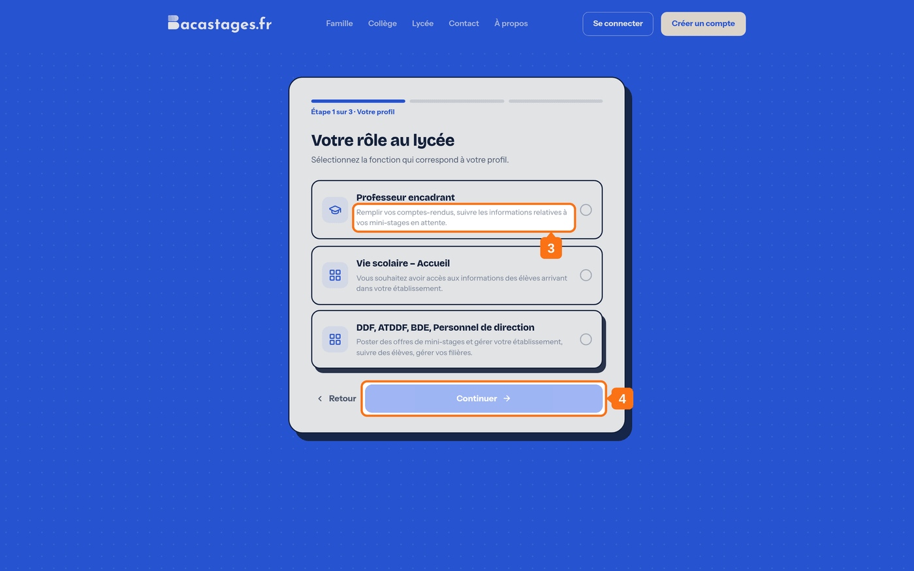
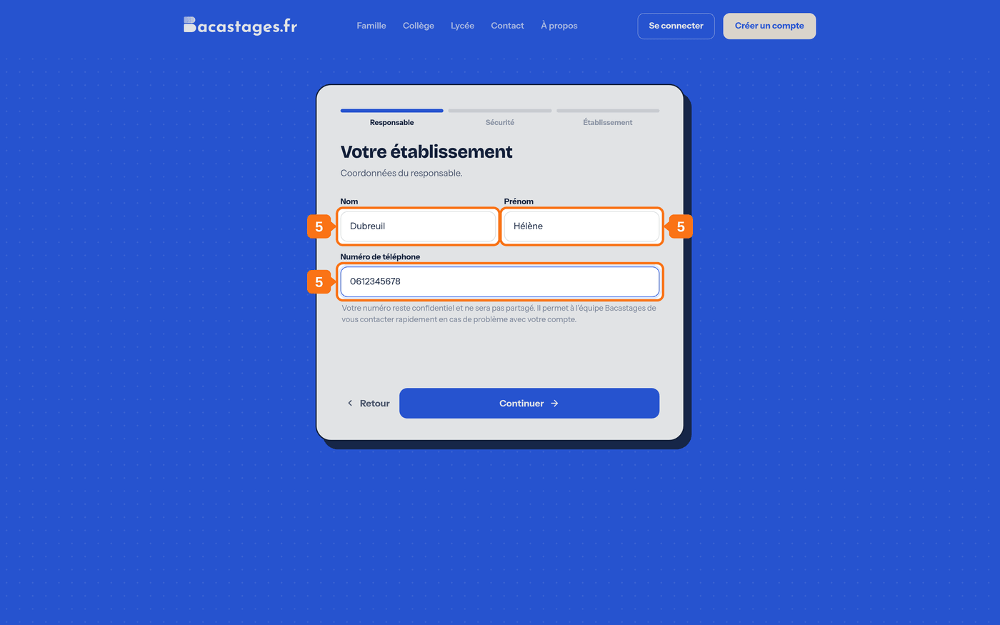
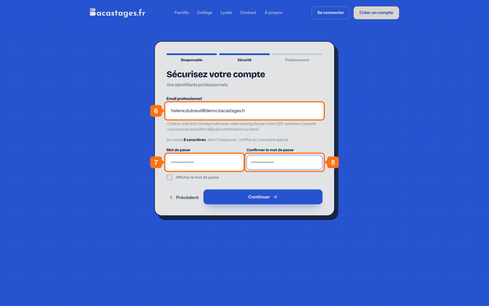
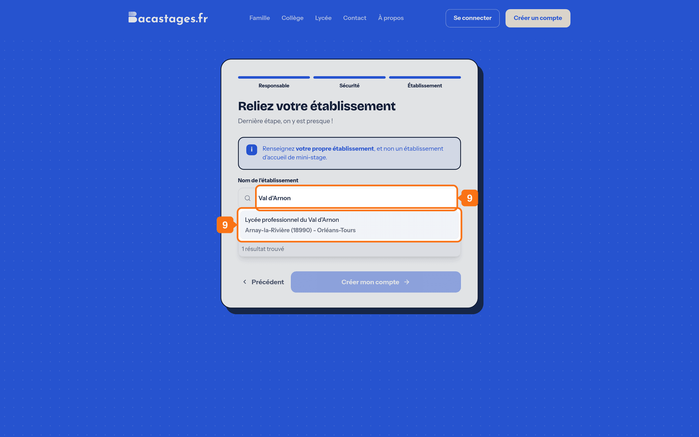
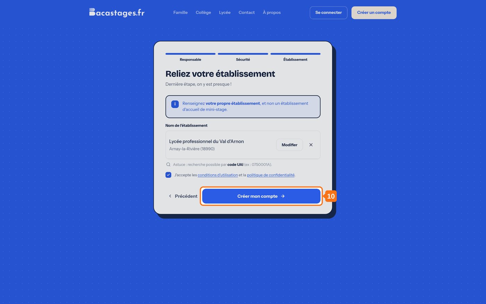

## Objectif

Créer votre compte professeur sur Bacastages.

## Avant de commencer : en avez-vous besoin ?

**Un professeur n'a pas obligatoirement de compte Bacastages.** Votre établissement peut vous envoyer un **lien d'accès personnel** qui vous ouvre vos mini-stages de l'année, appel et comptes rendus compris, **sans mot de passe et sans inscription**.

| Vous voulez | Ce qu'il vous faut |
|---|---|
| Faire l'appel et rédiger vos comptes rendus | **Rien à créer.** Demandez le lien d'accès à votre établissement, et voyez **« Guide : gérer les mini-stages sans compte professeur »** |
| Consulter le calendrier, retrouver vos anciens mini-stages, gérer vos accès | **Un compte**, décrit ci-dessous |

> **Si vous avez déjà reçu un lien par e-mail, vous n'avez rien à faire ici.** Ce lien suffit.

## Ce qu'il vous faut

- Votre adresse e-mail professionnelle, de préférence académique
- Le nom ou le **code UAI** de votre lycée
- Votre numéro de téléphone

---

## 1. Ouvrir la page d'inscription

Rendez-vous sur **bacastages.fr** et cliquez sur **« Créer un compte »**.

> Le bouton porte **« Créer un compte gratuit »** en bas de la page d'accueil, et **« Créer un compte »** sur la page dédiée aux lycées. Les deux mènent au même endroit.

## 2. Choisir le profil « Lycée »

L'écran **« Étape 1 sur 3 · Votre profil »** propose plusieurs cartes. Choisissez **« Lycée »**.

> **Ne prenez pas « Compte Inscription »** : cette carte est celle des collèges, CIO et structures qui *inscrivent* des élèves dans les mini-stages d'un autre établissement.

## 3. Choisir « Professeur encadrant »

L'écran suivant, **« Votre rôle au lycée »**, propose trois fonctions. Sélectionnez **« Professeur encadrant »** : *« Remplir vos comptes-rendus, suivre les informations relatives à vos mini-stages en attente. »*

## 4. Continuer

Cliquez sur **« Continuer »**.

## 5. Renseigner votre identité

Complétez votre **nom**, votre **prénom** et votre **numéro de téléphone**.

## 6. Créer vos identifiants

Saisissez votre **adresse e-mail**, de préférence académique.

## 7. Choisir un mot de passe

Il doit compter **au moins 8 caractères**, dont **une minuscule, une majuscule, un chiffre et un caractère spécial**, et ne contenir **aucun espace**.

> C'est la règle complète. Un mot de passe de huit lettres sera refusé.

## 8. Confirmer le mot de passe

Ressaisissez-le à l'identique.

## 9. Rattacher votre établissement

Cherchez votre lycée par son nom ou par son **code UAI**, puis sélectionnez-le dans la liste.

> Si votre établissement ne ressort pas, voyez **« Mon établissement n'apparaît pas dans la recherche »**.

## 10. Valider l'inscription

Acceptez les conditions, puis cliquez sur **« Créer mon compte »**.

## 11. Ouvrir l'e-mail de validation

Il arrive de **team@notif.bacastages.fr**. S'il n'est pas dans votre boîte de réception, regardez votre courrier indésirable.

## 12. Cliquer sur le lien de validation

Votre adresse est confirmée et vous pouvez vous connecter.

> **Vous n'avez rien reçu ?** Sur la page de connexion, un bouton **« Renvoyer un lien »** apparaît tant que votre adresse n'est pas validée. Il mène à la page **« Validez votre email »**, où **« Renvoyer un email »** relance l'envoi.

---

## Vous y êtes

Connectez-vous : l'entrée **« Mini-stages prof »** de la navigation vous donne accès à vos élèves.

> **Votre compte n'est pas votre fiche professeur.** Ce sont deux choses distinctes : votre établissement tient une fiche à votre nom, sur laquelle il vous affecte des mini-stages. Il peut la **relier** à votre compte — c'est ce qui fait apparaître vos mini-stages dans « Mini-stages prof ». Si vous ne voyez rien après connexion, demandez-lui de faire ce lien.

---

## Besoin d'aide ?

- **Par email :** [support@bacastages.fr](mailto:support@bacastages.fr)
- **Par le chat :** la bulle en bas à droite de votre écran
