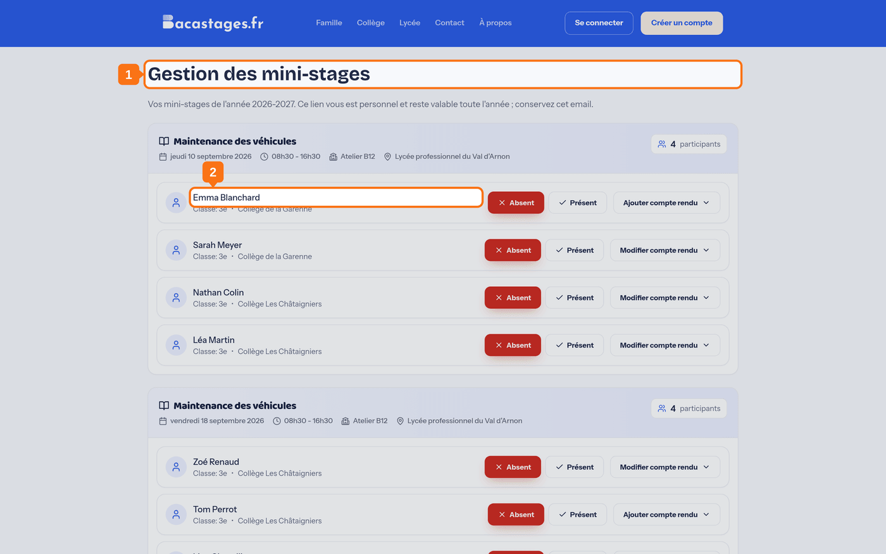
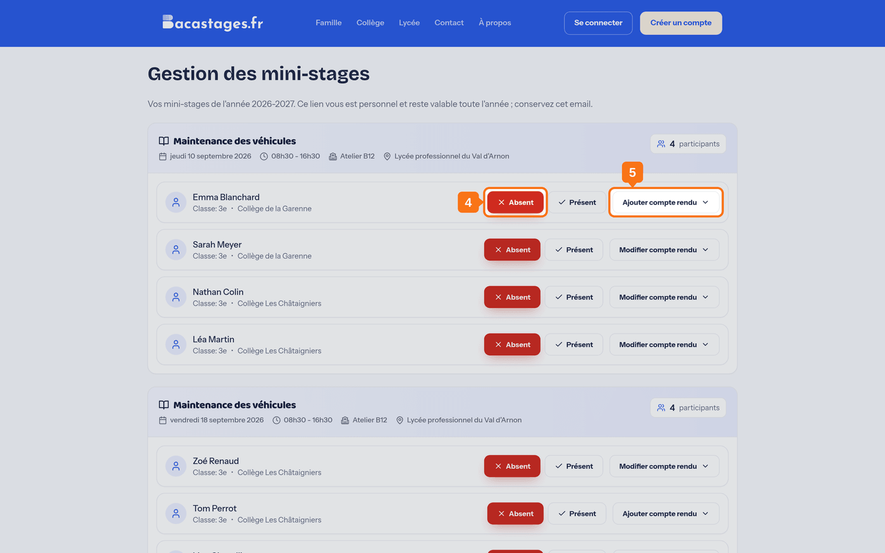
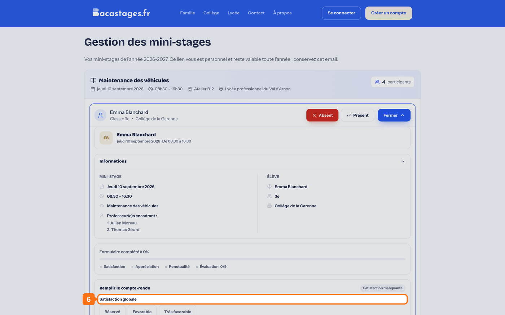

## Objectif

Faire l'appel et rédiger vos comptes rendus **sans créer de compte Bacastages**.

Cet article s'adresse aux **professeurs qui n'ont pas de compte**, et qui n'en ont pas besoin.

## Ce qu'il vous faut

- Le **lien reçu par e-mail**, envoyé par votre établissement
- Une connexion internet

> Il n'y a **rien à installer, rien à créer, aucun mot de passe à retenir**.

---

## Deux liens différents, sachez lequel vous avez

| Le lien | Ce qu'il ouvre | Quand vous le recevez |
|---|---|---|
| **Lien de session** | **Un seul** mini-stage | Dans un e-mail de rappel, à l'approche d'une séance |
| **Lien d'accès personnel** | **Tous vos mini-stages de l'année** | Une fois, envoyé par votre établissement, avec un e-mail de bienvenue |

> **Demandez le lien d'accès personnel à votre établissement.** C'est le confortable : un seul lien, conservé dans vos favoris, qui suit toute votre année.

---

## 1. Ouvrir le lien

Cliquez sur le lien reçu. Vous arrivez sur l'écran **« Gestion des mini-stages »**, sans aucune connexion à faire.

## 2. Retrouver vos élèves

L'écran liste vos mini-stages et, pour chacun, les élèves attendus.

> Avec le lien d'accès personnel, **les mini-stages à venir y figurent aussi**, même quand aucun compte rendu n'a encore été ouvert.

## 3. Pointer sa présence

Sur la ligne de l'élève, deux boutons : **« Absent »** et **« Présent »**. Un clic suffit : rien n'est à enregistrer ensuite.

> **Tout se fait sur la ligne de l'élève.** Cet écran n'a pas de fiche à ouvrir : la présence et le compte rendu y sont directement.

> Les boutons ne s'activent **que le jour du mini-stage**.

## 4. Ouvrir son compte rendu

Cliquez sur **« Ajouter compte rendu »**, ou sur **« Modifier compte rendu »** s'il en existe déjà un.

## 5. Remplir le compte rendu

Le formulaire est le même que pour un professeur connecté : une **appréciation générale** obligatoire, un champ **« Votre appréciation »**, et, si votre établissement utilise le compte rendu détaillé, la **ponctualité** et **neuf critères** en trois familles.

Le détail est dans l'article **« Rédiger le compte rendu d'un élève »**.

## 6. Enregistrer

---

## Votre commentaire remplace le précédent

Quand vous rouvrez un compte rendu que vous avez déjà commenté, l'écran vous prévient : *« Si vous avez déjà ajouté un commentaire, il sera remplacé par celui que vous enregistrez maintenant. »*

**Relisez avant d'enregistrer** : l'ancien texte ne se récupère pas.

---

## « Ce lien a été remplacé »

Ce message signifie que votre établissement vous a envoyé un **nouveau** lien : l'envoi d'un lien d'accès invalide tous les précédents.

**Cherchez le message le plus récent de Bacastages dans votre boîte** — c'est celui-là qui fonctionne. Si vous ne le retrouvez pas, demandez à votre établissement de vous le renvoyer.

> Votre établissement peut aussi **révoquer** l'accès par lien. Dans ce cas, aucun lien ne fonctionne plus tant qu'il ne vous en envoie pas un nouveau.

---

## Faut-il créer un compte, finalement ?

Pas pour l'appel ni pour les comptes rendus : ce lien y suffit toute l'année.

Un compte n'apporte que deux choses de plus : le **calendrier** des créneaux de l'établissement, et la gestion de vos propres accès. Si cela ne vous sert pas, restez sur le lien.

---

## Besoin d'aide ?

- **Par email :** [support@bacastages.fr](mailto:support@bacastages.fr)
- **Par le chat :** la bulle en bas à droite de votre écran
